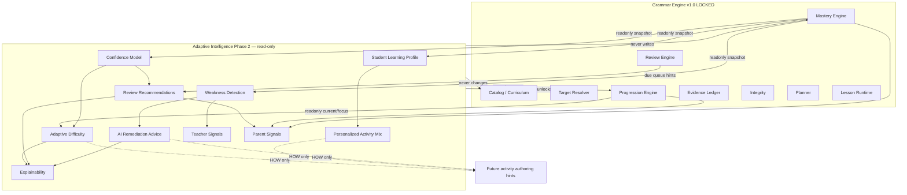
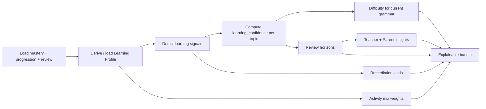

# Adaptive Learning Intelligence — Architecture (Phase 2)

Grammar Engine v1.0 remains the production baseline. Adaptive Intelligence sits
**above** it and is strictly read-only with respect to curriculum, mastery,
progression, resolver, evidence ledger, integrity, planner, and lesson runtime.

## Core principle

| Layer | Decides |
| --- | --- |
| Curriculum / Catalog / Progression | **What** should be learned |
| Adaptive Intelligence | **How** this student should learn it |

Never invert these responsibilities.

## Architecture diagram

## Recommendation engine flow

## Difficulty model

| Level | Vocabulary | Sentences | Distractors | Listening | Writing |
| --- | --- | --- | --- | --- | --- |
| Easy | low | short | soft | slow | supported |
| Normal | medium | medium | balanced | normal | standard |
| Advanced | high | long | challenging | fast | extended |

Grammar target (`grammar_id`) is never changed by difficulty.

## Weakness detection strategy

Deterministic thresholds over mastery records:

- recurring mistakes — low accuracy with ≥3 evidence
- forgotten grammar — long idle (≥21 days) with prior mastery
- low confidence — high mastery + low `learning_confidence`
- repeated retries — many evidence + weak accuracy/confidence
- long inactivity — idle ≥9 days
- unstable performance — low stability
- retention risk — elevated `retention_risk`
- skill gap — single-skill evidence concentration

## JSONB namespace

Profile persistence (optional) uses sibling key:

`promotion_readiness_json["adaptive_intelligence"]`

It must never mutate `promotion_readiness_json["grammar"]`.

## Out of scope (Phase 2)

- AI Tutor memory
- Conversational coaching
- Curriculum / unlock / mastery mutations
