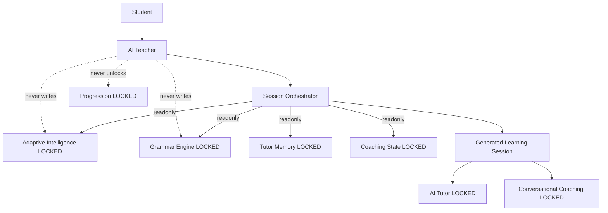

# Autonomous AI Teacher — Architecture (Phase F)

All lower layers are **LOCKED**. The AI Teacher sits entirely above them.

## Core principle

| Never decides | Only decides |
| --- | --- |
| Grammar progression | Today's teaching flow |
| Mastery / unlocks | Review timing |
| Curriculum | Activity ordering |
| Resolver targets | Explanation strategy, pacing, motivation, coaching conduct |

## Architecture



## Session pipeline

```
Student → Read Grammar → Read Adaptive → Read Tutor/Coaching signals
  → Generate Today's Session (goals, review, order, mission, weekly, journey, wrap-up)
```

## Session structure

Welcome → Today's Goal → Quick Review → Main Lesson → Practice → Speaking → Quiz → Reflection → Summary → Tomorrow Preview

## Safety

- May write only `promotion_readiness_json["ai_teacher"]` session plans
- Must never write mastery, progression, evidence, curriculum, adaptive, tutor memory, or coaching state
- No educational state flows backward from the AI Teacher

## Out of scope

Voice avatar, emotions, and gamification are not part of Phase F.
