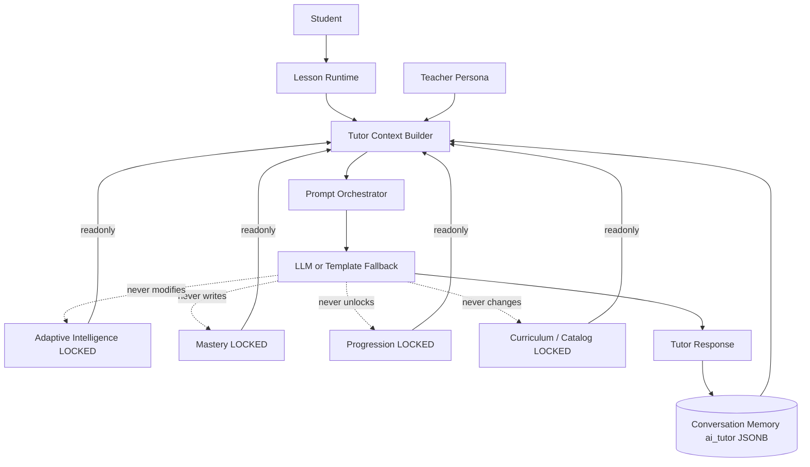

# AI Tutor Foundation — Architecture (Wave E1)

Grammar Engine v1.0 and Adaptive Learning Intelligence remain **LOCKED**.
The AI Tutor is an orchestration / communication layer — never a second source of truth.

## Core principle

Educational decisions already exist. The AI Tutor only communicates them.

## Architecture diagram



## Tutor Context schema

`TutorContext` projects only prompt-safe fields:

- current grammar surface (`grammar_id`, display, examples, mistakes)
- session awareness (lesson / activity / completed / remaining)
- adaptive surface (pace, confidence, difficulty, signals, remediations)
- learning profile preferences (copied, never written back)
- teacher persona (`persona_id`, tone, traits)
- conversation memory summary
- curriculum version + student language
- explanation style + explainability note
- safety code

`TutorContext.to_prompt_dict()` is the only LLM payload shape.

## Conversation Memory schema

Stored under `promotion_readiness_json["ai_tutor"]` only:

- `conversation_id`, turns (`student` / `tutor`)
- preferred tone / explanation / examples
- recurring questions, unfinished discussion

**Not** mastery, progression, evidence, adaptive profile, or grammar state.

## Prompt Orchestrator

```
Tutor Context → Prompt Orchestrator → LLM Prompt → LLM → Tutor Response
```

Modular kinds: `explain`, `hint`, `quiz_help`, `review`, `motivation`, `lesson_summary`, `answer_question`.

Shared system rules + per-kind instruction; no prompt duplication of educational logic.

## Teacher Persona integration

Reuses `language_grammar_activity_authoring.types.TeacherPersona`.
Configurable catalog (`default_tutor`, `encouraging_coach`, `calm_guide`) with stable traits:
supportive, patient, encouraging, clear, professional, age-appropriate.

## Adaptive explanation flow

```
Learning Profile / confidence / weakness signals
  → ExplanationStyle (simplified | guided | concise | analogy)
  → style instructions in prompt
  → explainability_note (transparent to student)
```

Grammar target never changes.

## Read-only contract

| May write | Must never write |
| --- | --- |
| Conversation Memory (`ai_tutor`) | Mastery |
| | Progression |
| | Resolver targets |
| | Evidence / ledger |
| | Curriculum / catalog |
| | Adaptive Intelligence / Learning Profile |
| | Lesson Runtime state |

## Safety rules

1. No grammar → fail closed.
2. Requested grammar ≠ current lesson grammar → reject.
3. Never explain a different topic as “today’s lesson”.
4. Never hallucinate unlocks or progression.
5. Template fallback still bound to current grammar.

## Out of scope (Wave E2)

- Conversational coaching / Socratic tutoring
- Long-term coaching plans
- Autonomous lesson planning
