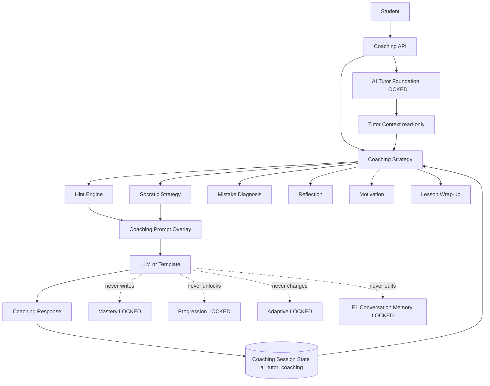

# Conversational Coaching — Architecture (Wave E2)

AI Tutor Foundation (Wave E1) is **LOCKED**. This wave extends tutoring behavior only.

## Core principle

Teach by coaching. Guide first. Reveal only when appropriate.
Educational authority remains outside the Tutor.

## Architecture



## Hint ladder

```
Hint Level 1 → Hint Level 2 → Hint Level 3 → Full explanation → Worked example
```

Never skip to the final answer unless the student explicitly requests it.

## Coaching moves

Explain · Hint · Question · Challenge · Review · Encourage · Recap · Diagnose · Reflect · Wrap-up

Decision inputs: conversation coaching state, learning profile (via TutorContext), confidence, weakness signals, current activity, current grammar.

## Read-only contract

| May write | Must never write |
| --- | --- |
| `ai_tutor_coaching` session state | Mastery / Progression / Resolver |
| | Evidence / Curriculum / Adaptive |
| | E1 Conversation Memory / Prompt Orchestrator / Persona modules |

## Out of scope

Long-term autonomous lesson planning remains outside E2.
