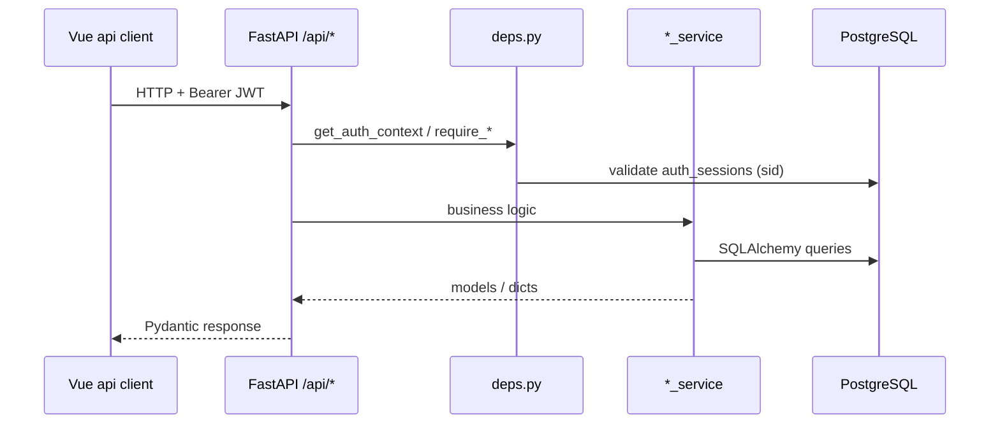
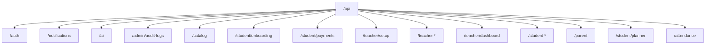
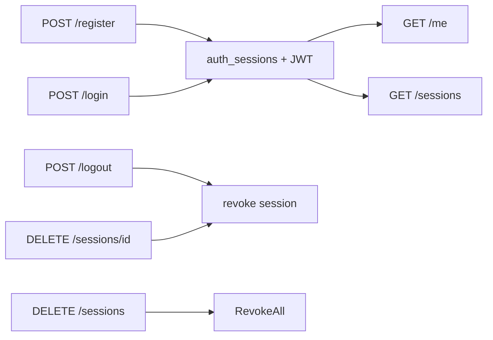
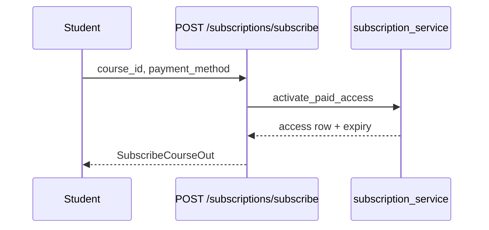
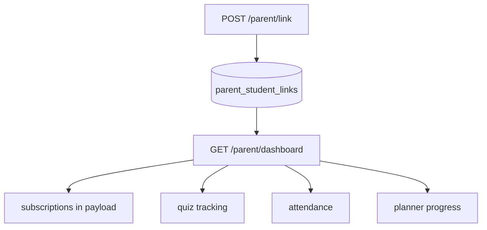
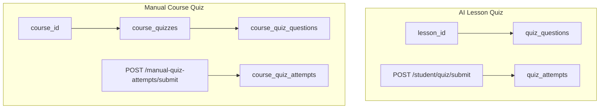
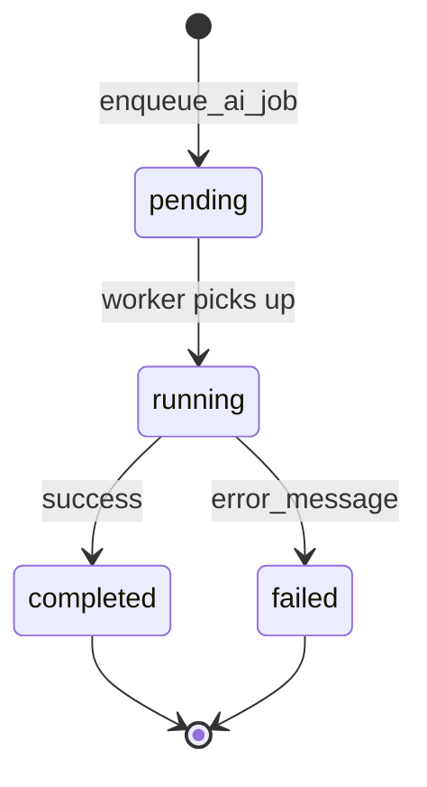
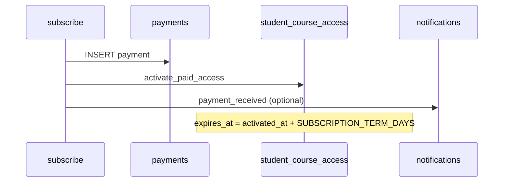

# EduSpark — API Architecture

**Base URL:** `{host}/api` (`settings.API_PREFIX`, default `/api`)  
**Interactive docs:** `/docs` (Swagger) · `/redoc`  
**Health:** `GET /health` (no prefix)  
**Static media:** `GET /uploads/{path}`  

**Related:** [SYSTEM_ARCHITECTURE.md](./SYSTEM_ARCHITECTURE.md) · [ERD.md](./ERD.md)

---

## 1. Request flow

### 1.1 Authentication header

| Header | Value |
|--------|--------|
| `Authorization` | `Bearer <access_token>` |

Access token payload: `sub` (user id), `role`, optional `sid` (session id), optional `viewer_mode`.

### 1.2 Common HTTP status codes

| Code | Typical cause |
|------|----------------|
| 401 | Missing/invalid token or revoked session |
| 403 | Wrong role or parent viewer on write endpoint |
| 404 | Resource not found or not linked |
| 400 | Validation / business rule (Arabic `detail` messages) |

### 1.3 Router registry

All routers are mounted in `app/api/router.py` on `api_router`, then included in `main.py` with prefix `/api`.

\* Multiple modules share `/teacher` and `/student` prefixes; FastAPI merges routes by path.

---

## 2. Route groups

| Group | Prefix | Module | Auth |
|-------|--------|--------|------|
| Authentication | `/auth` | `auth.py` | Mixed (public register/login) |
| Notifications | `/notifications` | `notifications.py` | Authenticated |
| AI jobs | `/ai` | `ai_jobs.py` | Authenticated |
| Admin audit | `/admin/audit-logs` | `audit_admin.py` | Admin role |
| Catalog | `/catalog` | `catalog.py` | Public / optional auth |
| Student onboarding | `/student/onboarding` | `onboarding.py` | Student |
| Payments (legacy bulk) | `/student/payments` | `payments.py` | Student |
| Teacher setup | `/teacher/setup` | `teacher_setup.py` | Teacher |
| Teacher (legacy uploads) | `/teacher` | `teacher.py` | Teacher |
| Teacher voice | `/teacher` | `teacher_voice.py` | Teacher |
| Lesson publish | `/teacher` | `lesson_publish.py` | Teacher |
| Teacher courses | `/teacher` | `teacher_courses.py` | Teacher |
| Manual quizzes (teacher) | `/teacher` | `course_quizzes.py` | Teacher |
| Manual quizzes (student) | `/student` | `course_quizzes.py` | Student |
| Teacher dashboard | `/teacher/dashboard` | `teacher_dashboard.py` | Teacher |
| Student learning | `/student` | `student.py` | Student |
| Student courses & subscriptions | `/student` | `student_courses.py` | Student |
| Parent monitoring | `/parent` | `parent.py` | Parent / student (link-code) |
| AI planner | `/student/planner` | `planner.py` | Student |
| Attendance | `/attendance` | `attendance.py` | Student or parent viewer |

### 2.1 Frontend API clients

| Backend group | `src/api/*.js` |
|---------------|----------------|
| Auth | `auth.js` |
| Catalog | `catalog.js` |
| Onboarding | `onboarding.js` |
| Payments | `payments.js` |
| Teacher setup | `teacherSetup.js` |
| Teacher legacy + voice (partial) | `teacher.js` |
| Teacher courses | `teacherCourses.js` |
| Teacher dashboard | `teacherDashboard.js` |
| Manual quizzes | `manualQuizzes.js` |
| Student lessons/chat/quiz | `student.js` |
| Student courses & subscriptions | `studentCourses.js`, `subscriptions.js` |
| Parent | `parent.js` |
| Planner | `planner.js` |
| Attendance | `attendance.js` |
| Notifications | `notifications.js` |
| Shared HTTP | `client.js` |

---

## 3. Authentication APIs

**Prefix:** `/api/auth`  
**Tag:** Authentication

| Method | Path | Auth | Description |
|--------|------|------|-------------|
| `GET` | `/auth/me` | Bearer | Current user + flags (`needs_onboarding`, `needs_payment`, `teacher_setup_complete`, …) |
| `POST` | `/auth/register` | Public | Register student / teacher / parent; creates profile row; returns tokens |
| `POST` | `/auth/login` | Public | Email/password login; creates session |
| `POST` | `/auth/logout` | Bearer | Revoke current session (+ optional refresh token body) |
| `GET` | `/auth/sessions` | Bearer | List active devices/sessions |
| `DELETE` | `/auth/sessions/{session_id}` | Bearer | Revoke one session |
| `DELETE` | `/auth/sessions` | Bearer | Revoke all sessions for user |

### 3.1 Request/response schemas (key)

| Schema | Fields (summary) |
|--------|------------------|
| `RegisterRequest` | `name`, `email`, `password`, `role`, optional `device_name` |
| `LoginRequest` | `email`, `password`, optional `device_name` |
| `TokenResponse` | `access_token`, `refresh_token`, `session_id`, `user`, optional `viewer_mode` |
| `UserOut` | `id`, `name`, `email`, `role`, onboarding/payment/setup flags |
| `AuthSessionOut` | `id`, `device_name`, `device_type`, `user_agent`, `ip_address`, `last_seen_at`, `created_at`, `is_current` |

### 3.2 Role registration behavior

| `role` | Server-side side effect |
|--------|-------------------------|
| `student` | Creates `student_profiles` at onboarding step `grade` |
| `teacher` | Creates `teacher_profiles` |
| `parent` | User row only; link students after login |

---

## 4. Student APIs

Student endpoints are split across **four prefixes** that all require `require_student_actor()` unless noted.

### 4.1 Onboarding — `/api/student/onboarding`

| Method | Path | Description |
|--------|------|-------------|
| `GET` | `/student/onboarding/status` | Current step and selections |
| `PUT` | `/student/onboarding/grade` | Set grade level |
| `PUT` | `/student/onboarding/subjects` | Select subjects |
| `PUT` | `/student/onboarding/teachers` | Select teachers per subject |
| `POST` | `/student/onboarding/complete` | Finish onboarding |

### 4.2 Courses, dashboard, subscriptions — `/api/student`

| Method | Path | Description |
|--------|------|-------------|
| `GET` | `/student/dashboard` | Enrolled courses, progress, locks |
| `GET` | `/student/courses/{course_id}` | Course detail + lessons |
| `GET` | `/student/subscriptions` | Catalog of subscribable courses |
| `POST` | `/student/subscriptions/subscribe` | Pay/unlock course; sets `activated_at` / `expires_at` |
| `POST` | `/student/lessons/{lesson_id}/complete` | Mark lesson complete; attendance hook |
| `GET` | `/student/lessons/{lesson_id}/status` | Progress + lock state for one lesson |

### 4.3 Lessons, tutor chat, AI lesson quizzes — `/api/student`

| Method | Path | Description |
|--------|------|-------------|
| `GET` | `/student/lessons` | Lesson cards (filtered by access) |
| `GET` | `/student/lesson/{lesson_id}` | Lesson detail (PDF, video, chat history) |
| `POST` | `/student/chat` | Text tutor message (RAG + LLM) |
| `POST` | `/student/chat/voice` | Voice tutor message |
| `DELETE` | `/student/lesson/{lesson_id}/chat` | Clear chat history |
| `GET` | `/student/quiz/{lesson_id}` | AI-generated lesson quiz questions |
| `POST` | `/student/lesson/{lesson_id}/quiz/regenerate` | Regenerate AI quiz (teacher-quality gate) |
| `POST` | `/student/lesson/{lesson_id}/quiz/remedial` | Remedial quiz variant |
| `POST` | `/student/quiz/submit` | Submit AI lesson quiz attempt |
| `GET` | `/student/profile` | Student profile |
| `PUT` | `/student/profile` | Update interests, difficulty, avatar |
| `GET` | `/student/linked-parents` | Parents linked via `parent_student_links` |

### 4.4 Manual course quizzes — `/api/student`

| Method | Path | Description |
|--------|------|-------------|
| `GET` | `/student/courses/{course_id}/manual-quizzes` | List quizzes for course |
| `GET` | `/student/manual-quizzes/{quiz_id}` | Quiz take view |
| `POST` | `/student/manual-quizzes/{quiz_id}/start` | Start attempt |
| `PATCH` | `/student/manual-quiz-attempts/{attempt_id}/answers` | Autosave answers |
| `POST` | `/student/manual-quiz-attempts/{attempt_id}/submit` | Submit attempt |
| `GET` | `/student/manual-quiz-attempts/{attempt_id}` | Attempt result |

**Access rule:** Paid, non-expired `student_course_access` for the quiz’s course.

### 4.5 AI planner — `/api/student/planner`

| Method | Path | Description |
|--------|------|-------------|
| `GET` | `/student/planner` | Planner state (schedule slots, goals) |
| `POST` | `/student/planner/chat` | Planner assistant chat |
| `POST` | `/student/planner/optimize` | Re-optimize schedule |
| `POST` | `/student/planner/sessions/complete` | Mark study session complete |

### 4.6 Payments (legacy onboarding checkout) — `/api/student/payments`

| Method | Path | Description |
|--------|------|-------------|
| `GET` | `/student/payments/checkout` | Bulk checkout summary (onboarding path) |
| `POST` | `/student/payments/demo-checkout` | Demo payment completion |

> Per-course subscriptions prefer `POST /student/subscriptions/subscribe`.

### 4.7 Parent link code (student-only on parent router)

| Method | Path | Auth | Description |
|--------|------|------|-------------|
| `GET` | `/parent/link-code` | Student | Returns/generates `parent_link_code` on profile |

---

## 5. Teacher APIs

Teacher routes share `/api/teacher` across multiple modules.

### 5.1 Setup — `/api/teacher/setup`

| Method | Path | Description |
|--------|------|-------------|
| `GET` | `/teacher/setup/status` | Setup wizard progress |
| `PUT` | `/teacher/setup/profile` | Name, bio |
| `POST` | `/teacher/setup/avatar` | Upload avatar |
| `PUT` | `/teacher/setup/teaching` | Grades taught |
| `GET` | `/teacher/setup/subjects` | Subjects available for teacher |
| `POST` | `/teacher/setup/courses` | Initial course stubs |
| `POST` | `/teacher/setup/complete` | Mark setup complete |

### 5.2 Voice profile — `/api/teacher`

| Method | Path | Description |
|--------|------|-------------|
| `GET` | `/teacher/voice-profile` | Derived persona metadata |
| `GET` | `/teacher/voice-sample` | Latest voice sample status |
| `POST` | `/teacher/voice-sample` | Upload voice sample |
| `POST` | `/teacher/voice-samples/{sample_id}/regenerate` | Re-process sample |
| `POST` | `/teacher/voice-samples/{sample_id}/preview` | TTS preview audio |

### 5.3 Legacy lesson pipeline — `/api/teacher`

| Method | Path | Description |
|--------|------|-------------|
| `POST` | `/teacher/upload/pdf` | Upload PDF → create lesson |
| `POST` | `/teacher/upload/voice` | Attach voice to lesson |
| `POST` | `/teacher/lessons/{lesson_id}/process` | Run AI processing (chunks, quiz) |
| `GET` | `/teacher/content` | List teacher lessons |
| `DELETE` | `/teacher/lessons/{lesson_id}` | Delete lesson |

### 5.4 Course & lesson management — `/api/teacher`

| Method | Path | Description |
|--------|------|-------------|
| `GET` | `/teacher/courses/form-context` | Grades/subjects for create form |
| `GET` | `/teacher/courses` | List teacher courses |
| `POST` | `/teacher/courses` | Create course |
| `POST` | `/teacher/courses/create` | Create with full metadata |
| `PUT` | `/teacher/courses/{course_id}` | Update course |
| `GET` | `/teacher/courses/{course_id}/lessons` | List lessons in course |
| `POST` | `/teacher/courses/{course_id}/lessons` | Add lesson |
| `POST` | `/teacher/courses/{course_id}/lessons/full` | Add lesson with all assets |
| `POST` | `/teacher/courses/{course_id}/lessons/video` | Video lesson |
| `POST` | `/teacher/courses/{course_id}/lessons/pdf` | PDF lesson |
| `POST` | `/teacher/courses/{course_id}/lessons/homework` | Homework lesson |
| `POST` | `/teacher/courses/{course_id}/lessons/smart-pdf` | Smart PDF + AI pipeline |
| `POST` | `/teacher/courses/{course_id}/lessons/{lesson_id}/process` | Process lesson in course context |
| `POST` | `/teacher/courses/{course_id}/lessons/{lesson_id}/quiz/regenerate` | Regenerate course lesson quiz |

### 5.5 Lesson publish — `/api/teacher`

| Method | Path | Description |
|--------|------|-------------|
| `POST` | `/teacher/lessons/publish` | Publish lesson to students |
| `GET` | `/teacher/lessons/{lesson_id}/publish-status` | Publish job status |

### 5.6 Teacher dashboard — `/api/teacher/dashboard`

| Method | Path | Description |
|--------|------|-------------|
| `GET` | `/teacher/dashboard/overview` | KPIs, subscription summary |
| `GET` | `/teacher/dashboard/grades` | Grade-level rollup |
| `GET` | `/teacher/dashboard/courses/{course_id}` | Per-course analytics + subscribers |

### 5.7 Manual quizzes (teacher builder) — `/api/teacher`

| Method | Path | Description |
|--------|------|-------------|
| `GET` | `/teacher/courses/{course_id}/manual-quizzes` | List quizzes |
| `POST` | `/teacher/courses/{course_id}/manual-quizzes` | Create quiz |
| `GET` | `/teacher/courses/{course_id}/manual-quizzes/{quiz_id}` | Quiz + questions |
| `PUT` | `/teacher/courses/{course_id}/manual-quizzes/{quiz_id}` | Update quiz |
| `DELETE` | `/teacher/courses/{course_id}/manual-quizzes/{quiz_id}` | Delete quiz |
| `POST` | `.../questions` | Add question |
| `PUT` | `.../questions/{question_id}` | Update question |
| `DELETE` | `.../questions/{question_id}` | Delete question |
| `GET` | `.../results` | All attempts summary |
| `GET` | `.../attempts/{attempt_id}` | Single attempt detail |
| `POST` | `.../attempts/{attempt_id}/questions/{question_id}/grade` | Grade essay |
| `GET` | `.../analytics` | Per-quiz analytics |
| `GET` | `/teacher/courses/{course_id}/manual-quiz-analytics` | Course-wide quiz analytics |

---

## 6. Parent APIs

**Prefix:** `/api/parent`  
**Auth:** `require_parent_viewer()` → `users.role == parent`

Most endpoints accept optional query `?student_id=` when multiple children are linked; default is first/primary linked student.

| Method | Path | Description |
|--------|------|-------------|
| `GET` | `/parent/students` | Linked children list |
| `POST` | `/parent/link` | Link via `link_code` |
| `DELETE` | `/parent/link/{student_id}` | Unlink child |
| `GET` | `/parent/dashboard` | Full dashboard aggregate (includes subscriptions) |
| `GET` | `/parent/activity` | Activity feed |
| `GET` | `/parent/insights` | AI/rule insights |
| `GET` | `/parent/quiz` | Quiz performance tracking |
| `GET` | `/parent/attendance` | Attendance summary |
| `GET` | `/parent/course-progress` | Grade reports per course |
| `GET` | `/parent/planner-progress` | Study planner progress |

**Student-only (same router):**

| Method | Path | Auth | Description |
|--------|------|------|-------------|
| `GET` | `/parent/link-code` | Student | Generate/show link code for parents |

---

## 7. Quiz APIs

EduSpark exposes **two quiz systems**.

### 7.1 Comparison

| Aspect | AI lesson quiz | Manual course quiz |
|--------|----------------|-------------------|
| Tables | `quiz_questions`, `quiz_attempts` (lesson-scoped) | `course_quizzes`, `course_quiz_questions`, `course_quiz_attempts` |
| Teacher APIs | Regenerate via `teacher_courses` / `student` regenerate | Full CRUD under `/teacher/.../manual-quizzes` |
| Student APIs | `/student/quiz/{lesson_id}`, `/student/quiz/submit` | `/student/manual-quizzes/*` |
| Generation | `quiz_service` + LLM at lesson process time | Teacher-authored questions |
| Grading | Auto + remedial flow | Auto + manual essay grading endpoint |

### 7.2 AI lesson quiz endpoints (summary)

| Role | Endpoints |
|------|-----------|
| Student | `GET /student/quiz/{lesson_id}`, `POST /student/quiz/submit`, remedial/regenerate |
| Teacher | `POST /teacher/courses/.../quiz/regenerate`, lesson `process` creates questions |

### 7.3 Manual quiz endpoints (summary)

See **§4.4** (student) and **§5.7** (teacher).

---

## 8. AI APIs

### 8.1 Job status — `/api/ai`

| Method | Path | Auth | Description |
|--------|------|------|-------------|
| `GET` | `/ai/jobs/{job_id}` | Bearer | Poll `ai_jobs` status (`pending` / `running` / `completed` / `failed`) |

Jobs are **enqueued** by lesson processing and publish flows (`ai_job_service.enqueue_ai_job`), not via a public “create job” REST endpoint.

### 8.2 AI capabilities invoked via other routes

| Capability | Trigger endpoints | Service |
|------------|-------------------|---------|
| PDF extract + chunk | `POST .../process`, smart-pdf upload | `pdf_service`, `lesson_processor` |
| Embeddings / FAISS | Lesson process (if `ENABLE_EMBEDDINGS`) | `embedding_service` |
| Tutor chat | `POST /student/chat`, `/chat/voice` | `rag_service`, `ai_service` |
| Quiz generation | Lesson process, regenerate endpoints | `quiz_service` |
| Voice transcription | Voice upload, voice-sample | `voice_service` |
| TTS | Voice preview | `tts_service` |
| Planner chat | `POST /student/planner/chat` | `planner_chat_service` |

### 8.3 AI-related tables

| Table | Purpose |
|-------|---------|
| `ai_jobs` | Async job queue metadata |
| `content_chunks` | RAG text segments |
| `chat_messages` | Student tutor history |
| `teacher_voice_samples` | Raw voice uploads |
| `quiz_questions` | AI-generated lesson questions |

---

## 9. Payment APIs

### 9.1 Per-course subscription (primary)

| Method | Path | Description |
|--------|------|-------------|
| `GET` | `/student/subscriptions` | Available courses + current access state |
| `POST` | `/student/subscriptions/subscribe` | Creates `payments` / `payment_items`, activates access |

**`SubscribeCourseRequest`:** `course_id`, payment method fields (demo integration).

**Side effects:** `integration_hooks.after_payment_success`, notifications, analytics rollup refresh.

### 9.2 Legacy bulk checkout

| Method | Path | Description |
|--------|------|-------------|
| `GET` | `/student/payments/checkout` | Onboarding payment summary |
| `POST` | `/student/payments/demo-checkout` | Complete demo checkout for selected courses |

### 9.3 Payment data model

| Table | Role |
|-------|------|
| `payments` | Payment header (student, amount, status) |
| `payment_items` | Line items per course |
| `student_course_access` | `payment_status`, `activated_at`, `expires_at` |

---

## 10. Cross-cutting APIs

### 10.1 Catalog — `/api/catalog`

| Method | Path | Auth | Description |
|--------|------|------|-------------|
| `GET` | `/catalog/grades` | Public | Grade levels |
| `GET` | `/catalog/subjects` | Public | Subjects (optional grade filter) |
| `GET` | `/catalog/teachers` | Public | Teacher cards for onboarding |

### 10.2 Notifications — `/api/notifications`

| Method | Path | Description |
|--------|------|-------------|
| `GET` | `/notifications` | Paginated list |
| `GET` | `/notifications/unread-count` | Badge count |
| `POST` | `/notifications/{notification_id}/read` | Mark one read |
| `POST` | `/notifications/read-all` | Mark all read |

**Types include:** subscription expiring/expired, payment received, lesson published, parent alerts.

### 10.3 Attendance — `/api/attendance`

| Method | Path | Auth | Description |
|--------|------|------|-------------|
| `GET` | `/attendance/summary` | Student or parent viewer | Summary stats |
| `GET` | `/attendance/records` | Student or parent viewer | Daily records |
| `GET` | `/attendance/weekly` | Student or parent viewer | Weekly view |
| `GET` | `/attendance/monthly` | Student or parent viewer | Monthly view |

Auto-written by `attendance_activity_service` on lesson complete, quiz submit, planner session complete.

### 10.4 Admin audit — `/api/admin/audit-logs`

| Method | Path | Auth | Description |
|--------|------|------|-------------|
| `GET` | `/admin/audit-logs` | `require_admin` | Filterable audit log list |

---

## 11. Authorization quick reference

| Dependency | Used by |
|------------|---------|
| `get_auth_context` | Notifications, AI jobs, attendance (partial) |
| `require_student_actor` | Student writes, link-code |
| `require_role(teacher)` | All teacher mutation routes |
| `require_parent_viewer` | Parent monitoring reads |
| `require_admin` | Audit logs |

**Parent viewer mode** (`viewer_mode=parent` in JWT): legacy; login rejects direct parent-viewer on student accounts. Parents use dedicated `role=parent` accounts.

---

## 12. Error and commit conventions

| Pattern | Detail |
|---------|--------|
| Transactions | Routers call `await db.commit()` after mutating operations |
| Arabic errors | `HTTPException(detail="...")` user-facing strings |
| File uploads | `multipart/form-data`; stored under `UPLOAD_DIR` |
| Idempotency | Subscription expiration notifications dedupe by `access_id` + marker in payload |

---

## 13. OpenAPI and testing

| Resource | URL |
|----------|-----|
| Swagger UI | `/docs` |
| ReDoc | `/redoc` |
| Health | `/health` |

Use Swagger to inspect full Pydantic schemas per endpoint.

---

## 14. Versioning

API version is tied to application release (`FastAPI` app `version="1.0.0"`). Database schema version follows Alembic revisions (`0001` … `0007_subscription_lifecycle`). No URL path versioning (`/v1`) is used today.
