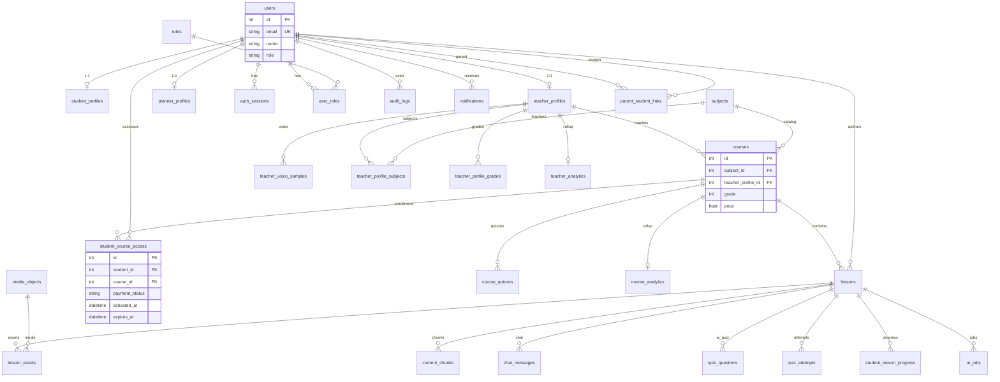
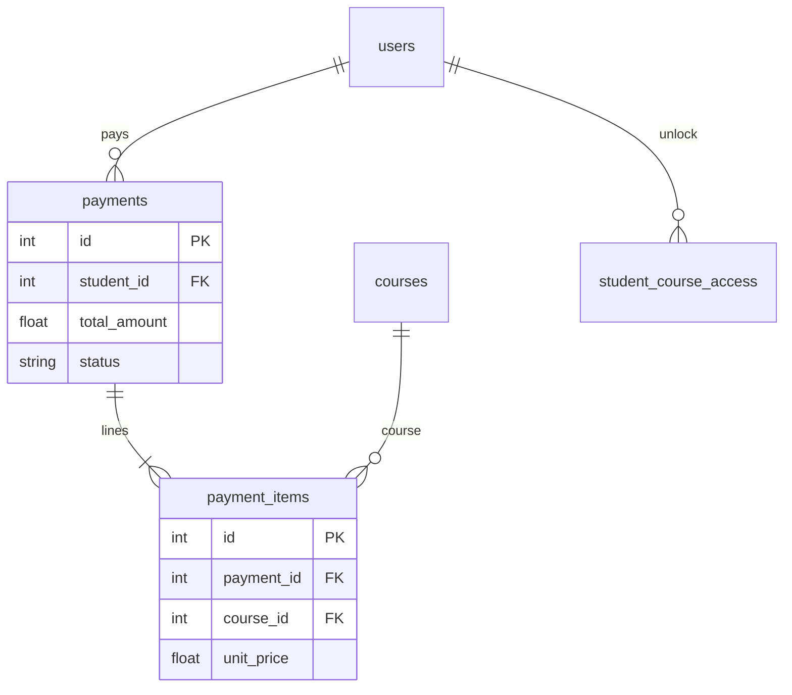
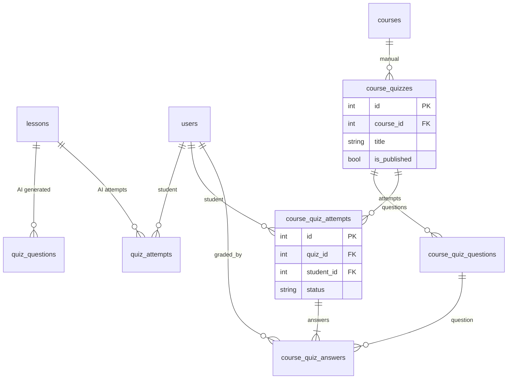
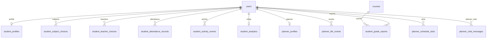
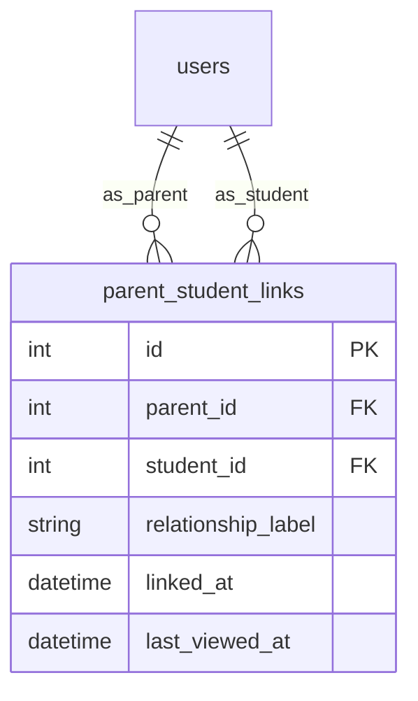

# EduSpark — Entity Relationship Diagram

**Sources:** `backend/app/models/*.py` (SQLAlchemy 2.x)  
**Migrations:** `backend/alembic/versions/` (`0001` → `0007_subscription_lifecycle`, head)  
**Database:** PostgreSQL  

**Companion file:** [ERD.dbml](./ERD.dbml) — import into [dbdiagram.io](https://dbdiagram.io) or VS Code DBML extension.

---

## Summary

| Metric | Count |
|--------|------:|
| **Entities (tables)** | **47** |
| **Many-to-many (explicit join tables)** | **4** |
| **One-to-one extensions** | **3** |
| **Analytics rollup tables (PK = FK)** | **3** |

---

## Alembic migration map

| Revision | Adds / changes (high level) |
|----------|-----------------------------|
| `0001_baseline` | Placeholder; schema from legacy/bootstrap |
| `0002_lesson_asset_type_enum` | `lessonassettype` enum on `lesson_assets` |
| `0003_course_manual_quizzes` | `course_quizzes`, `course_quiz_questions`, `course_quiz_attempts`, `course_quiz_answers` |
| `0004_teacher_voice_samples` | `teacher_voice_samples` |
| `0005_production_platform_upgrade` | `auth_sessions`, `media_objects`, `lesson_assets`, `audit_logs`, `notifications`, `roles`, `user_roles`, analytics rollups, `ai_jobs`, indexes |
| `0006_parent_link_code` | `student_profiles.parent_link_code` |
| `0007_subscription_lifecycle` | `student_course_access.activated_at`, `expires_at` |

---

## Entities by domain

### Authentication (5)

| Table | PK | Description |
|-------|-----|-------------|
| `users` | `id` | All accounts (student, teacher, parent); `role` enum column |
| `auth_sessions` | `id` | Refresh-token sessions / devices |
| `roles` | `id` | Extended roles (e.g. `admin` slug) |
| `user_roles` | `id` | User ↔ role assignments |
| `audit_logs` | `id` | Immutable audit trail |

### Teachers (5)

| Table | PK | Description |
|-------|-----|-------------|
| `teacher_profiles` | `id` | Teacher public profile (1:1 `users`) |
| `teacher_voice_samples` | `id` | Voice samples for AI/TTS |
| `teacher_profile_subjects` | `id` | **M2M** teacher ↔ subject |
| `teacher_profile_grades` | `id` | Grades taught (per teacher) |
| `teacher_analytics` | `teacher_profile_id` | Rollup metrics (PK = FK) |

### Students (12)

| Table | PK | Description |
|-------|-----|-------------|
| `student_profiles` | `id` | Onboarding, grade, preferences (1:1 `users`) |
| `student_subject_choices` | `id` | Onboarding subject picks |
| `student_teacher_choices` | `id` | Onboarding teacher per subject |
| `student_course_access` | `id` | Enrollment + subscription window |
| `student_lesson_progress` | `id` | Lesson completion |
| `student_attendance_records` | `id` | Daily attendance |
| `student_activity_events` | `id` | Activity feed |
| `planner_profiles` | `id` | Smart planner settings (1:1 `users`) |
| `planner_life_events` | `id` | Blocking life events |
| `planner_schedule_slots` | `id` | Scheduled study slots |
| `planner_chat_messages` | `id` | Planner AI chat |
| `student_analytics` | `student_id` | Rollup metrics (PK = FK) |

### Parents (1)

| Table | PK | Description |
|-------|-----|-------------|
| `parent_student_links` | `id` | **M2M** parent user ↔ student user |

### Courses (3)

| Table | PK | Description |
|-------|-----|-------------|
| `subjects` | `id` | Catalog subject per grade |
| `courses` | `id` | Teachable course (subject + teacher + grade) |
| `course_analytics` | `course_id` | Rollup metrics (PK = FK) |

### Lessons (5)

| Table | PK | Description |
|-------|-----|-------------|
| `lessons` | `id` | Lesson content under course |
| `lesson_assets` | `id` | Ordered assets per lesson |
| `content_chunks` | `id` | PDF/RAG text chunks |
| `chat_messages` | `id` | Student ↔ AI tutor per lesson |
| `media_objects` | `id` | Object storage metadata |

### Quizzes (6)

| Table | PK | Description |
|-------|-----|-------------|
| `quiz_questions` | `id` | AI-generated questions per **lesson** |
| `quiz_attempts` | `id` | Student attempts (lesson quiz) |
| `course_quizzes` | `id` | Teacher-authored **course** quiz |
| `course_quiz_questions` | `id` | Questions in course quiz |
| `course_quiz_attempts` | `id` | One attempt per student per quiz |
| `course_quiz_answers` | `id` | Per-question answers in attempt |

### Payments (3)

| Table | PK | Description |
|-------|-----|-------------|
| `payments` | `id` | Checkout / payment header |
| `payment_items` | `id` | Line items (courses) |
| `student_course_access` | `id` | *(also under Students)* — unlock + expiry |

### Analytics (4)

| Table | PK | Description |
|-------|-----|-------------|
| `course_analytics` | `course_id` | Course rollup |
| `teacher_analytics` | `teacher_profile_id` | Teacher rollup |
| `student_analytics` | `student_id` | Student rollup |
| `student_grade_reports` | `id` | Per student+course report (parent dashboard) |

### AI (2)

| Table | PK | Description |
|-------|-----|-------------|
| `ai_jobs` | `id` | Async job queue (PDF, embeddings, quiz, voice) |
| `content_chunks` | `id` | RAG chunks (optional pgvector at DB level) |

### Notifications (1)

| Table | PK | Description |
|-------|-----|-------------|
| `notifications` | `id` | In-app (and channel-ready) notifications |

---

## Primary keys

All entities use surrogate integer `id` **except** analytics rollups:

| Table | Primary key |
|-------|-------------|
| `course_analytics` | `course_id` |
| `teacher_analytics` | `teacher_profile_id` |
| `student_analytics` | `student_id` |

---

## Foreign keys (reference graph)

| Child table | FK column(s) | Parent table | ON DELETE (typical) |
|-------------|--------------|--------------|---------------------|
| `auth_sessions` | `user_id` | `users` | CASCADE |
| `user_roles` | `user_id`, `role_id` | `users`, `roles` | CASCADE |
| `audit_logs` | `actor_user_id` | `users` | SET NULL |
| `student_profiles` | `user_id` | `users` | — |
| `teacher_profiles` | `user_id` | `users` | — |
| `teacher_voice_samples` | `teacher_profile_id` | `teacher_profiles` | CASCADE |
| `teacher_profile_subjects` | `teacher_profile_id`, `subject_id` | `teacher_profiles`, `subjects` | CASCADE |
| `teacher_profile_grades` | `teacher_profile_id` | `teacher_profiles` | CASCADE |
| `courses` | `subject_id`, `teacher_profile_id` | `subjects`, `teacher_profiles` | — |
| `lessons` | `teacher_id`, `course_id` | `users`, `courses` | — / — |
| `lesson_assets` | `lesson_id`, `media_object_id` | `lessons`, `media_objects` | CASCADE / SET NULL |
| `content_chunks` | `lesson_id` | `lessons` | CASCADE |
| `chat_messages` | `lesson_id`, `student_id` | `lessons`, `users` | CASCADE / — |
| `quiz_questions` | `lesson_id` | `lessons` | CASCADE |
| `quiz_attempts` | `lesson_id`, `student_id` | `lessons`, `users` | CASCADE / — |
| `student_lesson_progress` | `student_id`, `lesson_id` | `users`, `lessons` | CASCADE |
| `student_subject_choices` | `student_id`, `subject_id` | `users`, `subjects` | CASCADE |
| `student_teacher_choices` | `student_id`, `subject_id`, `teacher_profile_id` | `users`, `subjects`, `teacher_profiles` | — |
| `student_course_access` | `student_id`, `course_id` | `users`, `courses` | CASCADE |
| `payments` | `student_id` | `users` | CASCADE |
| `payment_items` | `payment_id`, `course_id` | `payments`, `courses` | CASCADE |
| `parent_student_links` | `parent_id`, `student_id` | `users`, `users` | — |
| `course_quizzes` | `course_id` | `courses` | CASCADE |
| `course_quiz_questions` | `quiz_id` | `course_quizzes` | CASCADE |
| `course_quiz_attempts` | `quiz_id`, `student_id` | `course_quizzes`, `users` | CASCADE |
| `course_quiz_answers` | `attempt_id`, `question_id`, `graded_by_user_id` | `course_quiz_attempts`, `course_quiz_questions`, `users` | CASCADE |
| `notifications` | `user_id` | `users` | CASCADE |
| `student_attendance_records` | `student_id` | `users` | — |
| `student_activity_events` | `student_id` | `users` | — |
| `planner_*` | `student_id` | `users` | — |
| `student_grade_reports` | `student_id`, `course_id` | `users`, `courses` | CASCADE |
| `course_analytics` | `course_id` | `courses` | CASCADE |
| `teacher_analytics` | `teacher_profile_id` | `teacher_profiles` | CASCADE |
| `student_analytics` | `student_id` | `users` | CASCADE |
| `ai_jobs` | `lesson_id` | `lessons` | SET NULL |
| `media_objects` | `uploaded_by_user_id` | `users` | SET NULL |

---

## Relationship types

### One-to-one

| Parent | Child | Via |
|--------|-------|-----|
| `users` | `student_profiles` | `student_profiles.user_id` UNIQUE |
| `users` | `teacher_profiles` | `teacher_profiles.user_id` UNIQUE |
| `users` | `planner_profiles` | `planner_profiles.student_id` UNIQUE |

### One-to-many (selected)

| One | Many |
|-----|------|
| `users` | `auth_sessions`, `lessons` (as teacher), `payments`, `notifications`, `quiz_attempts`, … |
| `teacher_profiles` | `courses`, `teacher_voice_samples`, `teacher_profile_subjects` |
| `subjects` | `courses`, `student_subject_choices` |
| `courses` | `lessons`, `student_course_access`, `course_quizzes`, `payment_items` |
| `lessons` | `lesson_assets`, `content_chunks`, `chat_messages`, `quiz_questions` |
| `course_quizzes` | `course_quiz_questions`, `course_quiz_attempts` |
| `course_quiz_attempts` | `course_quiz_answers` |
| `payments` | `payment_items` |

### Many-to-many (join tables)

| Entity A | Join table | Entity B | Unique constraint |
|----------|------------|----------|-------------------|
| `users` (parent) | `parent_student_links` | `users` (student) | `(parent_id, student_id)` |
| `teacher_profiles` | `teacher_profile_subjects` | `subjects` | `(teacher_profile_id, subject_id)` |
| `users` | `user_roles` | `roles` | `(user_id, role_id)` |
| `users` (student) | `student_course_access` | `courses` | `(student_id, course_id)` — *enrollment with attributes* |

`teacher_profile_grades` is a **one-to-many** from teacher to grade integers (not a separate grade entity).

---

## Mermaid ERD — core platform

---

## Mermaid ERD — payments

---

## Mermaid ERD — quizzes (dual model)

---

## Mermaid ERD — students (engagement)

---

## Mermaid ERD — parents

---

## Cardinality legend

| Mermaid | Meaning |
|---------|---------|
| `\|\|--o\|` | One to zero-or-one |
| `\|\|--o{` | One to zero-or-many |
| `\|\|--\|{` | One to one-or-many |
| `}o--o{` | Many-to-many (via join table — draw separately) |

---

## Notes for implementers

1. **`users.role`** is the primary app role (`teacher` \| `student` \| `parent`). **`user_roles`** adds extra slugs (e.g. `admin`) without changing the enum column.
2. **Two quiz systems:** lesson-bound AI quizzes (`quiz_questions` / `quiz_attempts`) vs teacher course quizzes (`course_quiz_*`).
3. **`student_course_access`** is the source of truth for paid access; `activated_at` / `expires_at` (migration `0007`) drive subscription lifecycle.
4. **`content_chunks`** may gain a `vector` column when `ENABLE_PGVECTOR` is on; not modeled in SQLAlchemy by default.
5. **Parent accounts** are `users` with `role=parent`; linking is only via `parent_student_links` (no separate parent profile table).

---

## Viewing the diagram

- **DBML:** Open `docs/ERD.dbml` in [dbdiagram.io](https://dbdiagram.io) → Import.
- **Mermaid:** Paste sections into GitHub, Notion, or VS Code Markdown preview with Mermaid support.
