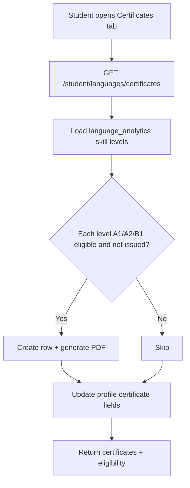

# Language Certificates (Phase D)

Certificate issuance, PDF download, and public verification for the English language learning module.

## Overview

Students earn CEFR certificates when **all four skills** (reading, listening, writing, speaking) meet the threshold for a given level. Certificates are stored in the existing `language_certificates` table, PDFs are generated on issuance, and anyone can verify a certificate by number.

**Out of scope:** AI evaluation, placement changes, CEFR recalculation from practice.

## Eligibility rules

Skill levels are read from `language_analytics` (set by placement; not recalculated here).

| Certificate | Requirement |
|-------------|-------------|
| **A1** | Reading ≥ A1, Listening ≥ A1, Writing ≥ A1, Speaking ≥ A1 |
| **A2** | All skills ≥ A2 |
| **B1** | All skills ≥ B1 |

Implementation: `meets_certificate_threshold()` in `backend/app/services/language_level_utils.py`.

Certificates are issued automatically when eligibility is checked and a level has not yet been awarded for that student/language.

## Database

Table: `language_certificates` (migration `0009_language_learning_phase2_placement.py`)

| Column | Purpose |
|--------|---------|
| `student_id`, `language_id` | Owner |
| `certificate_level` | A1, A2, or B1 |
| `certificate_number` | Unique public ID (`ES-LANG-{year}-{level}-{suffix}`) |
| `verification_code` | Printed on PDF |
| `certificate_status` | `issued` (revocation not implemented) |
| `verification_url` | Frontend verify link |
| `issued_at` | Issue timestamp |
| `pdf_url` | Static path under `/uploads/...` |

`language_student_profiles.certificate_level` / `certificate_awarded_at` are updated to the highest issued certificate.

## Backend

### Services

- **`language_certificate_service.py`**
  - `sync_eligible_certificates()` — issue missing certificates for eligible levels
  - `list_student_certificates()` — sync + list + eligibility matrix
  - `get_latest_certificate_summary()` — parent dashboard
  - `verify_certificate()` — public lookup by certificate number
  - `generate_certificate_pdf()` — PyMuPDF A4 PDF

### APIs

| Method | Path | Auth | Description |
|--------|------|------|-------------|
| GET | `/api/student/languages/certificates` | Student + subscription + placement | List certificates and eligibility |
| GET | `/api/verify-certificate/{certificate_number}` | Public | Verify certificate |

### PDF contents

- Student name  
- Certificate level (CEFR)  
- Certificate number  
- Issue date  
- Verification code  
- Verification URL  

Files: `uploads/student_{id}/certificates/{certificate_number}.pdf`

## Frontend

| Route | View | Description |
|-------|------|-------------|
| `/student/languages/certificates` | `StudentLanguageCertificatesView.vue` | Certificates tab — eligibility + download |
| `/verify-certificate/{certificate_number}` | `VerifyCertificateView.vue` | Public verification page |

**Student:** New **الشهادات** tab in `LanguageModuleTabs.vue`.

**Parent:** Latest certificate card in `ParentLanguageSection.vue` (from `language_placement.latest_certificate`).

## Issuance flow

Parent dashboard refresh follows the same sync when building `language_placement`.

## Verification flow

1. User opens `/verify-certificate/ES-LANG-2026-A1-XXXXXXXX`
2. Frontend calls `GET /api/verify-certificate/{number}`
3. Response shows **Valid / Invalid**, student name, level, issue date

## Configuration

- Verification links use the first entry in `CORS_ORIGINS` (default `http://localhost:5173`).
- PDFs served via FastAPI static mount `/uploads` (proxied in Vite dev).

## Testing checklist

1. Student with all skills ≥ A1 visits Certificates → A1 issued, PDF downloadable.
2. Student below A2 on any skill → A2 shows “not eligible”.
3. Public verify URL for valid number → Valid + details.
4. Invalid number → Invalid.
5. Parent dashboard shows latest certificate when present.

## Files added/updated

**Backend:** `language_certificate_service.py`, `language_certificate.py` (schema + API), `language_level_utils.py`, `language_student.py`, `parent_monitoring_service.py`, `parent.py`, `router.py`

**Frontend:** `StudentLanguageCertificatesView.vue`, `VerifyCertificateView.vue`, `LanguageModuleTabs.vue`, `ParentLanguageSection.vue`, `language.js`, `app.js`, `router/index.js`
