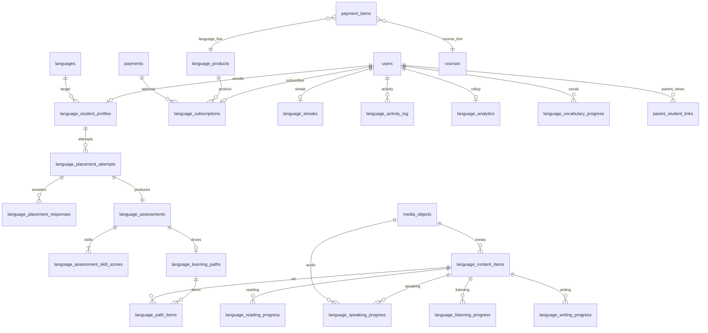
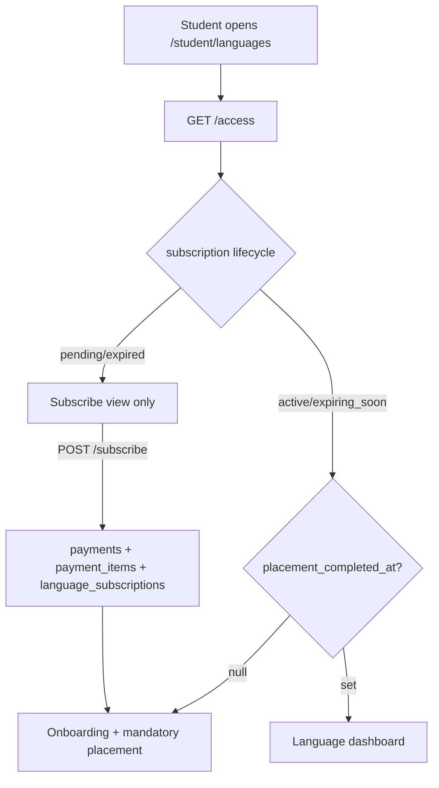

# EduSpark — Language Learning Module (Phase 1)

**Status:** Final architecture (approved) — pre-implementation  
**Scope:** English only · Students · Full parent monitoring · PostgreSQL · No mocks  
**Out of scope (Phase 1):** AI coaching, evaluators, conversation — hooks and schema reserved only.

**Related:** [SYSTEM_ARCHITECTURE.md](./SYSTEM_ARCHITECTURE.md) · [API_ARCHITECTURE.md](./API_ARCHITECTURE.md) · [ERD.md](./ERD.md)

---

## Approved design decisions (locked)

| # | Decision | Implementation |
|---|----------|----------------|
| 1 | Per-skill progress tables | `language_reading_progress`, `language_listening_progress`, `language_writing_progress`, `language_speaking_progress` (separate tables, no unified discriminator table) |
| 2 | Payments | Extend existing `payments` + `payment_items`; **no** parallel payment system |
| 3 | Speaking audio | `media_objects` + `UPLOAD_DIR` + existing upload conventions (`lesson_assets_service` / multipart patterns) |
| 4 | Placement retake | First assessment **mandatory**; retake allowed once every **90 days**; profile stores `last_assessment_date`, `next_allowed_retake_date` |
| 5 | Parent monitoring | Required; embedded in `GET /parent/dashboard` + dedicated parent language endpoints + parent alerts |
| 6 | CEFR levels | Official scale: **A1, A2, B1, B2, C1, C2** (`language_level` enum) |
| 7 | Student goals | `language_student_profiles.target_level`, `target_date` |
| 8 | Parent language alerts | Inactivity, level improvement, subscription expiry, streak milestones, repeated weakness |
| 9 | Overall level | **Not median.** Per-skill levels stored; overall via **bottleneck (minimum CEFR)** — see §10 |
| 10 | AI | Not implemented Phase 1; preserve `ai_evaluation_json`, `ai_jobs` hooks, `scoring_version` |

---

## Executive summary

Phase 1 adds a **Language Learning Subscription** product gated separately from course subscriptions. Students must complete a **mandatory four-skill placement test** before any curriculum content. CEFR levels are stored **per skill**; **overall level** uses a **bottleneck (lowest-skill)** rule so the headline level reflects communicative limit, not an average that hides weak speaking. Parents receive full progress visibility and five alert categories. All persistence is PostgreSQL via Alembic `0008`.

---

## 1. Updated database schema

### 1.1 Enums (PostgreSQL)

```sql
-- language_skill
reading | listening | writing | speaking

-- language_level (official CEFR)
A1 | A2 | B1 | B2 | C1 | C2

-- language_onboarding_step
select_language | placement | dashboard

-- language_placement_attempt_status
in_progress | submitted | abandoned

-- language_content_progress_status
not_started | in_progress | completed

-- payment_item_product_type (extend existing or new column)
course | language
```

### 1.2 Table catalog (18 tables + 1 ALTER)

#### Catalog & subscription

| Table | Columns (key) | Notes |
|-------|---------------|-------|
| `languages` | `id`, `code` (unique, `en`), `name_en`, `name_ar`, `is_active` | Phase 1: one row (`en`) |
| `language_products` | `id`, `slug` (`language_learning`), `name_ar`, `price`, `currency`, `term_days`, `is_active` | Sellable SKU |
| `language_subscriptions` | `id`, `student_id`, `product_id`, `payment_status`, `activated_at`, `expires_at`, `created_at` | Unique `(student_id, product_id)`; lifecycle mirrors `student_course_access` |

#### Student profile & goals

| Table | Columns (key) | Notes |
|-------|---------------|-------|
| `language_student_profiles` | `id`, `student_id`, `language_id`, `onboarding_step`, `selected_at`, `placement_completed_at`, **`target_level`**, **`target_date`**, **`last_assessment_date`**, **`next_allowed_retake_date`**, `preferences_json` (jsonb, AI-ready) | Unique `(student_id, language_id)` |

**Retake fields:**

- `last_assessment_date` — set when placement/retake assessment is finalized.
- `next_allowed_retake_date` — `last_assessment_date + 90 days` (config: `LANGUAGE_PLACEMENT_RETAKE_DAYS`).
- First visit: `next_allowed_retake_date` is NULL until first assessment completes.

#### Placement & assessment

| Table | Columns (key) | Notes |
|-------|---------------|-------|
| `language_placement_sections` | `id`, `language_id`, `skill`, `title_ar`, `sort_order` | 4 sections |
| `language_placement_questions` | `id`, `section_id`, `question_type`, `prompt_json`, `media_url`, `answer_key_json`, `max_points`, `level_hint` | Seeded content |
| `language_placement_attempts` | `id`, `student_id`, `language_id`, `status`, `is_retake`, `started_at`, `submitted_at` | One `in_progress` per student+language |
| `language_placement_responses` | `id`, `attempt_id`, `question_id`, `response_json`, `score`, `evaluation_metadata` (jsonb) | Phase 1 rule-based only |
| `language_assessments` | `id`, `student_id`, `language_id`, `attempt_id`, **`overall_level`**, `overall_calculation_method` (`bottleneck`), `completed_at` | Immutable snapshot |
| `language_assessment_skill_scores` | `id`, `assessment_id`, `skill`, `score_percent`, **`level`** (CEFR), `raw_metrics_json`, **`ai_evaluation_json`** (nullable) | Four rows per assessment |

#### Learning path

| Table | Columns (key) | Notes |
|-------|---------------|-------|
| `language_learning_paths` | `id`, `student_id`, `language_id`, `assessment_id`, `overall_level`, `path_json` (jsonb), `generated_at` | Regenerated on retake |
| `language_path_items` | `id`, `path_id`, `skill`, `level`, `content_item_id`, `sort_order`, `status` | Normalized units |

#### Content

| Table | Columns (key) | Notes |
|-------|---------------|-------|
| `language_content_items` | `id`, `language_id`, `skill`, `level`, `content_type`, `title`, `body_json`, `media_object_id` (nullable FK), `sort_order`, `is_published` | Listening audio via `media_objects` |

#### Per-skill progress (approved — separate tables)

| Table | Columns (key) | Notes |
|-------|---------------|-------|
| `language_reading_progress` | `id`, `student_id`, `content_item_id`, `status`, `score_percent`, `completed_at` | Unique `(student_id, content_item_id)` |
| `language_listening_progress` | same pattern | |
| `language_writing_progress` | `id`, `student_id`, `content_item_id`, `submitted_text`, `word_count`, `metrics_json`, `level_estimate`, `scoring_version`, **`ai_evaluation_json`**, `submitted_at` | |
| `language_speaking_progress` | `id`, `student_id`, `content_item_id`, **`media_object_id`** (FK), `transcript`, `metrics_json`, `level_estimate`, `scoring_version`, **`ai_evaluation_json`**, `submitted_at` | **No** raw `audio_path` column — use `media_objects.storage_key` |

#### Vocabulary, engagement, analytics

| Table | Columns (key) | Notes |
|-------|---------------|-------|
| `language_vocabulary_progress` | `id`, `student_id`, `language_id`, `lemma`, `first_seen_at`, `mastery_score` | Unique `(student_id, language_id, lemma)` |
| `language_streaks` | `id`, `student_id`, `language_id`, `current_streak`, `longest_streak`, `last_activity_date` | Unique `(student_id, language_id)` |
| `language_activity_log` | `id`, `student_id`, `language_id`, `event_type`, `skill`, `duration_seconds`, `payload_json`, `created_at` | Indexed by student + created_at |
| `language_analytics` | `student_id`, `language_id` (composite PK), `overall_level`, `reading_level`, `listening_level`, `writing_level`, `speaking_level`, `vocabulary_count`, `weekly_minutes_json`, `skill_growth_json`, `updated_at` | Rollup |

#### Payments (extend existing — approved)

**ALTER `payment_items`:**

| Column | Type | Constraint |
|--------|------|------------|
| `product_type` | enum `course` \| `language` | NOT NULL default `course` |
| `language_product_id` | FK → `language_products.id` | nullable |
| `course_id` | existing | nullable when language |

**CHECK:** exactly one of (`course_id`, `language_product_id`) is set per row:

```sql
CHECK (
  (product_type = 'course' AND course_id IS NOT NULL AND language_product_id IS NULL)
  OR
  (product_type = 'language' AND language_product_id IS NOT NULL AND course_id IS NULL)
)
```

`payments` table unchanged; `language_subscriptions` may reference `payments.id` after checkout.

### 1.3 Speaking storage flow

```mermaid
sequenceDiagram
  participant S as Student
  participant API as POST speaking/submit
  participant MO as media_objects
  participant SP as language_speaking_progress

  S->>API: multipart audio
  API->>MO: create row (storage_provider, storage_key, mime_type)
  API->>SP: media_object_id, transcript, metrics_json
  Note over API: Phase 1 STT via voice_service; no ai_evaluation_json yet
```

Reuse: `settings.UPLOAD_DIR`, path pattern `language/{student_id}/{uuid}.webm` (align with teacher upload conventions).

### 1.4 AI preservation (no implementation)

| Field / hook | Phase 1 | Phase 2+ |
|--------------|---------|----------|
| `ai_evaluation_json` on skill scores / progress | NULL | AI rubric output |
| `scoring_version` | `rule_v1` | `ai_v1` etc. |
| `ai_jobs.job_type` | Reserved: `language_writing_eval`, `language_speaking_eval`, `language_placement_eval` | Worker processes |
| `preferences_json` | `{}` | Coach settings |
| `integration_hooks.after_language_*` | No-op stubs or analytics only | Enqueue jobs |

---

## 2. Final ERD impact

### 2.1 New domain (add to ERD.md / ERD.dbml in Phase D)

**+18 tables**, **1 altered table** (`payment_items`), **+5 enums**.



### 2.2 Existing tables — no breaking changes

| Table | Impact |
|-------|--------|
| `users`, `auth_sessions` | None — role remains `student` |
| `notifications` | New `type` string values (no enum migration if using `String(64)`) |
| `student_activity_events` | Optional bridge from `language_activity_log` (Phase C) |
| `payments` | Unchanged schema |
| `payment_items` | **Additive** columns + CHECK |
| `media_objects` | New FKs from language tables |

### 2.3 TableGroup (dbdiagram.io)

Add **TableGroup LanguageLearning** — each language table listed **once** (learn from ERD.dbml duplicate fix).

---

## 3. Alembic migration plan (`0008`)

**Revision ID:** `0008_language_learning_phase1`  
**Revises:** `0007_subscription_lifecycle`  
**File:** `backend/alembic/versions/0008_language_learning_phase1.py`

### 3.1 Upgrade sequence

| Step | Action |
|------|--------|
| 1 | Create enums: `language_skill`, `language_level` (A1–C2), `language_onboarding_step`, `language_placement_attempt_status`, `language_content_progress_status`, `payment_item_product_type` |
| 2 | Create `languages`, `language_products` |
| 3 | Create `language_subscriptions` |
| 4 | Create `language_student_profiles` (with goals + retake dates) |
| 5 | Create placement tables (`sections`, `questions`, `attempts`, `responses`) |
| 6 | Create `language_assessments`, `language_assessment_skill_scores` |
| 7 | Create `language_learning_paths`, `language_path_items` |
| 8 | Create `language_content_items` |
| 9 | Create four progress tables + `language_vocabulary_progress` |
| 10 | Create `language_streaks`, `language_activity_log`, `language_analytics` |
| 11 | **ALTER** `payment_items`: add `product_type`, `language_product_id`, backfill `product_type='course'`, add CHECK constraint |
| 12 | Seed: `languages(en)`, `language_products`, placement banks, minimal content items |
| 13 | Register models in `app/models/__init__.py` |

### 3.2 Seed strategy (no mock API data)

| Data | Source |
|------|--------|
| English language row | Migration SQL or `seed_language_catalog.py` |
| Placement questions | JSON files in `backend/seed_data/language/` imported in migration |
| Listening audio | `media_objects` seed rows + static files in `uploads/language/seed/` |
| Dashboard content | ~3–5 items per skill per level band (A1–B1 minimum) |

### 3.3 Downgrade

1. Drop CHECK on `payment_items`; drop new columns.  
2. Drop language tables reverse FK order.  
3. Drop enums.

### 3.4 Post-deploy

```bash
cd backend && alembic upgrade head
```

Verify: `\d payment_items`, `SELECT * FROM languages;`

---

## 4. API route list (final)

**Student prefix:** `/api/student/languages`  
**Parent prefix:** `/api/parent/languages`  
**Auth:** existing JWT + `require_student_actor` / `require_parent_viewer`

### 4.1 Access & subscription

| Method | Path | Subscription | Placement |
|--------|------|--------------|-----------|
| GET | `/access` | — | — |
| GET | `/product` | — | — |
| POST | `/subscribe` | creates subscription | — |

### 4.2 Onboarding & placement

| Method | Path | Notes |
|--------|------|-------|
| GET | `/onboarding` | Step + languages + retake eligibility |
| PUT | `/onboarding/language` | Select English |
| GET | `/placement/eligibility` | `{ can_start, is_retake, next_allowed_retake_date }` |
| POST | `/placement/start` | 403 if retake before `next_allowed_retake_date` |
| GET | `/placement/active` | Resume in-progress |
| POST | `/placement/{attempt_id}/responses` | Batch save per section |
| POST | `/placement/{attempt_id}/submit` | Score, assessment, path, update profile dates |
| GET | `/placement/result` | Latest assessment + skill breakdown |
| GET | `/goals` | `target_level`, `target_date` |
| PUT | `/goals` | Update goals |

### 4.3 Dashboard & skills (require active subscription + placement complete)

| Method | Path |
|--------|------|
| GET | `/dashboard` |
| GET | `/reading` |
| GET | `/listening` |
| POST | `/reading/{content_id}/complete` |
| POST | `/listening/{content_id}/complete` |
| GET | `/writing` |
| POST | `/writing/submit` |
| GET | `/speaking` |
| POST | `/speaking/submit` | multipart → `media_objects` |
| GET | `/progress` |
| POST | `/activity` | optional explicit heartbeat |

### 4.4 Parent (read-only, linked student)

| Method | Path |
|--------|------|
| GET | `/parent/languages/summary?student_id=` |
| GET | `/parent/languages/assessments?student_id=` |
| GET | `/parent/languages/activity?student_id=` |
| GET | `/parent/languages/alerts?student_id=` | deduped alert feed |

**Embed:** `language` object on `GET /api/parent/dashboard` (required).

---

## 5. Parent dashboard additions

### 5.1 UI block: `ParentLanguageSection.vue`

| Section | Fields |
|---------|--------|
| Subscription | status badge (`active` / `expiring_soon` / `expired`), expiry date, renew CTA (link student flow) |
| Levels | Overall (bottleneck), Reading, Listening, Writing, Speaking — CEFR chips |
| Goals | `target_level`, `target_date` (if set) |
| Engagement | vocabulary count, current streak, weekly minutes chart |
| Assessment history | table: date, overall, four skills, retake flag |
| Insights | Strength / Needs improvement (rule-based) |
| Alerts | last 5 parent language alerts |

### 5.2 Backend: `parent_language_service`

Builds `ParentLanguageSummaryOut` from:

- `language_subscriptions` + lifecycle
- `language_analytics` rollup
- Latest `language_assessments` + skill scores
- `language_streaks`, activity log aggregates
- `parent_language_alert_service.get_recent_alerts()`

### 5.3 Parent language alerts (approved)

| Alert type | Trigger | Channel |
|------------|---------|---------|
| `language_inactivity` | No `language_activity_log` for N days (default 7) | `parent_alert` + student notification |
| `language_level_improved` | Any skill level increases vs previous assessment | parent + student |
| `language_subscription_expiring` | 7/3/1 days before `expires_at` | parent + student (reuse expiration loop pattern) |
| `language_subscription_expired` | `expires_at` passed | parent + student |
| `language_streak_milestone` | 7, 14, 30, 60 days | parent + student |
| `language_repeated_weakness` | Same skill lowest on 2+ consecutive assessments | parent only |

**Dedup:** `payload.marker` + `student_id` + `alert_type` (same pattern as course subscription notifications).

**NotificationType additions:**

- `language_inactivity`
- `language_level_improved`
- `language_subscription_expiring`
- `language_subscription_expired`
- `language_streak_milestone`
- `language_repeated_weakness`

---

## 6. Subscription enforcement flow



| Endpoint class | `pending` | `expired` | `expiring_soon` | `active` |
|----------------|-----------|-----------|-----------------|----------|
| `/access`, `/product`, `/subscribe` | ✓ | ✓ | ✓ | ✓ |
| `/placement/*` | ✗ | ✗ | ✓ | ✓ |
| `/dashboard`, skill tabs | ✗ | ✗ | ✓ | ✓ |
| Parent read summary | ✓ (shows status) | ✓ | ✓ | ✓ |

**HTTP:** `403` with body `{ "code": "language_subscription_required", "status": "expired", "redirect": "/student/languages/subscribe" }`.

**Expiration:** Extend `main.py` lifespan loop or add `language_subscription_expiration_service` parallel to course checker — same 7/3/1/expired markers.

---

## 7. Placement scoring methodology (Phase 1)

### 7.1 Per-skill score

```text
score_percent = (earned_points / max_points) * 100   # per section, then combine if multi-section
```

### 7.2 Per-skill CEFR mapping (configurable thresholds)

Stored in `backend/app/core/config.py` or DB table `language_cefr_thresholds` (Phase 1: config is enough).

Example defaults (tunable per skill):

| score_percent | CEFR |
|---------------|------|
| 0–20 | A1 |
| 21–35 | A2 |
| 36–55 | B1 |
| 56–70 | B2 |
| 71–85 | C1 |
| 86–100 | C2 |

Listening/Reading may use stricter cut scores than Writing/Speaking in Phase 1 seed config.

### 7.3 Skill-specific Phase 1 evaluators

| Skill | Input | Phase 1 logic |
|-------|-------|---------------|
| **Reading** | MCQ / gap-fill responses | Compare to `answer_key_json` |
| **Listening** | MCQ after audio | Compare to `answer_key_json`; audio from `media_url` or `media_objects` |
| **Writing** | Free text | `word_count`, sentence count, basic grammar rules (punctuation, capitalization), variety score → map to CEFR |
| **Speaking** | Audio file | Upload → `media_objects`; STT (`voice_service`); metrics: duration, WPM, prompt keyword coverage → map to CEFR |

All raw metrics → `raw_metrics_json`; `ai_evaluation_json` = NULL; `scoring_version` = `rule_v1`.

### 7.4 Retake policy enforcement

| Rule | Implementation |
|------|----------------|
| First assessment | Required when `placement_completed_at IS NULL` |
| Retake | Allowed if `now >= next_allowed_retake_date` |
| After submit | `last_assessment_date = now`, `next_allowed_retake_date = now + 90 days`, `placement_completed_at` set on first completion |
| Attempt flag | `language_placement_attempts.is_retake` |

---

## 8. Overall level calculation methodology

### 8.1 Approved approach: **Bottleneck (minimum CEFR rank)**

```text
CEFR_RANK = { A1: 1, A2: 2, B1: 3, B2: 4, C1: 5, C2: 6 }

overall_level = CEFR_LABEL(min(
  RANK(reading_level),
  RANK(listening_level),
  RANK(writing_level),
  RANK(speaking_level)
))
```

Store on `language_assessments.overall_level` with `overall_calculation_method = 'bottleneck'`.

### 8.2 Rationale (why not median or weighted average)

| Approach | Problem for EduSpark |
|----------|---------------------|
| **Median** | Hides weak speaking/listening; overall looks better than communicative reality; conflicts with parent "needs improvement" UX. |
| **Weighted average** | Requires arbitrary weights (e.g. 25% each); still allows one A1 skill to be diluted; harder to explain to Arabic-speaking parents. |
| **Bottleneck (chosen)** | Matches communicative proficiency ("you're limited by your weakest skill"); aligns with path generation starting at lowest gaps; honest parent dashboard; standard in holistic language reporting when reporting single band. |

**UI rule:** Always show **four skill levels prominently**; overall is a summary label, not a replacement.

### 8.3 Optional analytics-only metric (not Phase 1 headline)

`language_analytics.weighted_level` (future) may be added for internal charts without changing `overall_level` on assessments.

### 8.4 Path generation

`language_path_service` uses **per-skill levels** to pick content:

- Primary focus: skills at lowest CEFR (at or below `overall_level`).
- Include stretch content at `overall_level + 1` for strongest skill only.

### 8.5 Example

| Skill | Level |
|-------|-------|
| Reading | B2 |
| Listening | B1 |
| Writing | A2 |
| Speaking | A1 |
| **Overall (bottleneck)** | **A1** |

Strength: Reading. Needs improvement: Speaking.

---

## 9. Risks and migration concerns

| Risk | Severity | Mitigation |
|------|----------|------------|
| `payment_items` CHECK breaks legacy rows | High | Backfill `product_type='course'` before NOT NULL; verify all existing rows have `course_id` |
| Alembic head drift (DB at 0006/0007) | High | Document `alembic current` in deploy runbook; upgrade to 0007 before 0008 |
| Large seed migration runtime | Medium | Split seed to `0008` schema + `0009_language_seed` if needed |
| `pdfjs`/media upload size for speaking | Medium | Reuse `MAX_UPLOAD` config; validate mime types |
| Retake clock skew | Low | UTC timestamps; test 90-day boundary |
| Parent alert spam | Medium | Dedup markers; throttle inactivity to once per 7-day window |
| Bottleneck overall demotivating | Low | UX copy: "مستواك الإجمالي يعكس أقوى مهارة تحتاج تطويراً"; show all four skills |
| C2 content scarcity | Medium | Phase 1 seed focuses A1–B2; C1/C2 placement possible but limited content |
| `language_level` enum migration later | Low | Using PostgreSQL ENUM; adding values needs migration (C2 included now) |
| Duplicate TableGroup in ERD.dbml | Low | Single group for LanguageLearning |
| AI schema drift | Low | `ai_evaluation_json` + `ai_jobs` types reserved in Phase 1 |
| Expiration loop duplication | Medium | Shared helper for course + language subscription checks |
| Whisper/STT unavailable | Medium | Graceful degrade: speaking score from duration only + flag `stt_unavailable` in metrics |

### 9.1 Deployment checklist (Phase A)

- [ ] `alembic upgrade head` on staging
- [ ] Verify `payment_items` CHECK with test course + language checkout
- [ ] Smoke: subscribe → placement → dashboard
- [ ] Parent dashboard shows language block for linked student with subscription

---

## 10. Backend services (updated)

| Service | Responsibility |
|---------|----------------|
| `language_subscription_service` | Subscribe via `payments`/`payment_items`; lifecycle |
| `language_subscription_access_service` | `active` / `expiring_soon` / `expired` |
| `language_access_service` | FastAPI dependencies |
| `language_onboarding_service` | Steps + retake eligibility |
| `language_placement_service` | Attempts, responses, submit |
| `language_scoring_service` | Per-skill CEFR + **bottleneck overall** |
| `language_speaking_service` | Multipart → `media_objects` + STT |
| `language_path_service` | Path from per-skill levels |
| `language_progress_service` | Four progress tables |
| `language_streak_service` | Streaks |
| `language_activity_service` | Activity log + inactivity detector |
| `language_analytics_service` | Rollups |
| `language_notification_service` | Student + parent notifications |
| `parent_language_service` | Dashboard DTO |
| `parent_language_alert_service` | Five alert types + dedup |
| `language_subscription_expiration_service` | 7/3/1/expired loop |

**AI stubs (no implementation):** `language_ai_hooks.enqueue_*` → no-op Phase 1.

---

## 11. Frontend (summary)

| Route | Purpose |
|-------|---------|
| `/student/languages` | Hub / redirect |
| `/student/languages/subscribe` | Paywall |
| `/student/languages/onboarding` | Language select |
| `/student/languages/placement` | 4-skill wizard |
| `/student/languages/dashboard` | Tabs + goals |
| Sidebar | اللغات + premium badge |

---

## 12. Implementation phases (unchanged order)

| Phase | Focus |
|-------|--------|
| **A** | Migration 0008, models, subscription + paywall, `payment_items` extension |
| **B** | Placement + bottleneck scoring + retake policy |
| **C** | Dashboard tabs + four progress tables + speaking via `media_objects` |
| **D** | Parent section + five alert types + analytics |
| **E** | Hardening + ERD/API doc updates |

**Do not start coding until this document is approved.**

---

## Appendix A — Config

```python
LANGUAGE_SUBSCRIPTION_TERM_DAYS: int = 365
LANGUAGE_SUBSCRIPTION_EXPIRING_SOON_DAYS: int = 7  # align with course
LANGUAGE_PLACEMENT_RETAKE_DAYS: int = 90
LANGUAGE_INACTIVITY_ALERT_DAYS: int = 7
LANGUAGE_STREAK_MILESTONES: list[int] = [7, 14, 30, 60]
LANGUAGE_OVERALL_CALCULATION: str = "bottleneck"
```

---

## Appendix B — `ai_jobs` integration points (future)

| job_type | Trigger |
|----------|---------|
| `language_writing_eval` | After writing submit (Phase 2) |
| `language_speaking_eval` | After speaking submit (Phase 2) |
| `language_placement_eval` | Optional re-score (Phase 2) |

Phase 1: job types documented; enqueue functions exist as commented stubs in `language_ai_hooks.py`.

---

## Appendix C — Approved decisions traceability

| Requirement | Section |
|-------------|---------|
| Per-skill progress tables | §1.2 |
| `payment_items` extension | §1.2, §3 |
| `media_objects` speaking | §1.3 |
| 90-day retake + profile dates | §1.2, §7.4 |
| Parent monitoring | §5, §4.4 |
| CEFR A1–C2 | §1.1 |
| Student goals | §1.2, §4.2 |
| Parent alerts (5 types) | §5.3 |
| Bottleneck overall (not median) | §8 |
| AI hooks only | §1.4, Appendix B |
