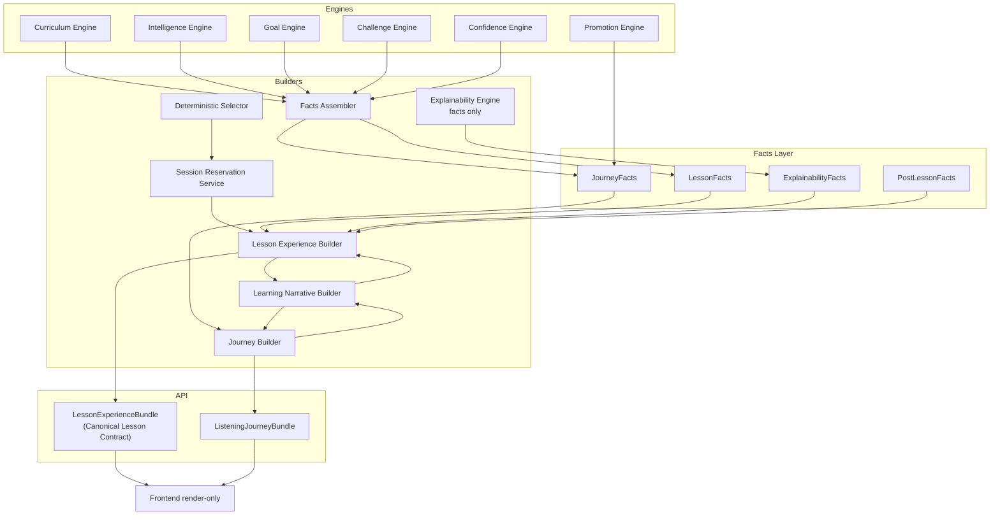
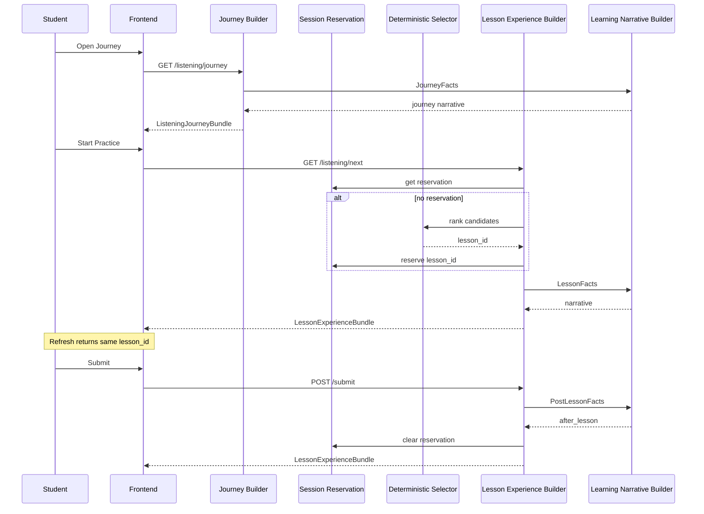

# Listening — Canonical Student Experience Architecture

**Status:** Canonical design — final pre-Phase 2  
**Scope:** Listening skill (student-facing experience)  
**Phase 2:** Implementation may begin **only after** this document is complete  
**Out of scope:** UI redesign, copy polish, production code in this document

**Document version:** 3.0

---

## Architecture Rule (Non-Negotiable)

> **Every student-visible piece of information must have exactly one owner.**

If two services can produce the same student-facing sentence, the architecture is **invalid**.

Corollaries:

- The frontend **never** merges sources, applies business rules, chooses templates, or constructs sentences.
- **Lesson-scoped** data and **journey-scoped** data **never** share a builder or a response object.
- **Facts** (structured, language-neutral) and **narrative** (student-facing copy) are **always** separate layers.
- A generic field name **"Goal"** must **never** appear in any API or UI contract.

---

## 1. Problem Statement

The current student experience is assembled from independent sources:

| Surface | Current source | Violation |
|---------|----------------|-----------|
| Journey Hero | Promotion status + `useListeningCoach` | Journey + lesson logic mixed in frontend |
| Personal preference chips | Learner memory → substring parsing | Personal Goal mistaken for Lesson Goal |
| Practice Mission | `lesson.coach` + memory + blockers | Multiple owners for "why" and "focus" |
| Post-lesson | Submit result + readiness delta + i18n templates | Frontend constructs educational guidance |
| `/listening/next` | Random selection per call | No session continuity |

Phase 2 replaces this with **three backend builders**, one **facts layer**, one **narrative layer**, and a **render-only frontend**.

---

## 2. Layered Architecture (Target)

```
┌─────────────────────────────────────────────────────────────────────────┐
│  ENGINES (recommendation & generation — write metadata at gen time)      │
│  Curriculum · Intelligence · Goal · Challenge · Confidence · Promotion   │
└─────────────────────────────────────────────────────────────────────────┘
                                    ↓
┌─────────────────────────────────────────────────────────────────────────┐
│  FACTS LAYER (structured, language-neutral, no student copy)             │
│  LessonFacts · JourneyFacts · PostLessonFacts · ExplainabilityFacts      │
└─────────────────────────────────────────────────────────────────────────┘
                                    ↓
┌─────────────────────────────────────────────────────────────────────────┐
│  LEARNING NARRATIVE BUILDER (single owner of all student-facing copy)    │
│  Converts facts → localized narrative strings / i18n-ready payloads      │
└─────────────────────────────────────────────────────────────────────────┘
                                    ↓
              ┌─────────────────────┴─────────────────────┐
              ↓                                           ↓
┌──────────────────────────────┐           ┌──────────────────────────────┐
│  JOURNEY BUILDER              │           │  LESSON EXPERIENCE BUILDER    │
│  Journey-scoped bundle only   │           │  Lesson-scoped bundle only    │
│  (no lesson playback)         │           │  (no journey timeline)        │
└──────────────────────────────┘           └──────────────────────────────┘
              ↓                                           ↓
     ListeningJourneyBundle                    LessonExperienceBundle
              ↓                                           ↓
┌─────────────────────────────────────────────────────────────────────────┐
│  FRONTEND (render-only — zero business rules)                             │
└─────────────────────────────────────────────────────────────────────────┘
```

**Session Reservation Service** (cross-cutting, not a builder) enforces lesson pinning between **Reserved** and **Completed | Skipped**.

---

## 3. Builder Responsibilities

### 3.1 Journey Builder

**Owns:** Everything about the learner's **overall listening journey** when no specific lesson interaction is required.

**Produces:** `ListeningJourneyBundle`

**Must NOT:** Include lesson playback, Lesson Goal narrative as Personal Goal, or generate student-facing sentences directly.

### 3.2 Lesson Experience Builder

**Owns:** Everything about **one selected listening lesson** — preview, active play, and post-completion narrative for that lesson.

**Produces:** `LessonExperienceBundle` (must conform to **Canonical Lesson Contract**, Section 5)

**Must NOT:** Include journey, promotion, history, or Personal Goal sections; generate copy directly; re-select lesson while **Reserved** or **Started**.

### 3.3 Learning Narrative Builder

**Owns:** **All** student-visible language.

**Must NOT:** Be invoked from Vue/composables; read raw engine metadata without Facts Layer.

### 3.4 Explainability Engine (Revised Role)

**Owns:** **Educational facts only** — no student-facing language.

Learning Narrative Builder converts `ExplainabilityFacts` → readable guidance.

---

## 4. Goal Terminology (Mandatory Rename)

| Term | Meaning | Owner | Appears in |
|------|---------|-------|------------|
| **Lesson Goal** | Goal assigned at lesson generation | Goal Engine → LessonFacts | `LessonExperienceBundle` only |
| **Personal Goal** | Learner preference from memory | Learner memory → JourneyFacts | `ListeningJourneyBundle` only |
| **Journey Target** | Next official CEFR level to unlock | Progression service → JourneyFacts | `ListeningJourneyBundle` only |

**Forbidden:** Unqualified `goal`, `learning_goal`, or `target_goal` in any API or UI contract.

Canonical field names: `lesson_goal`, `personal_goal`, `journey_target`.

---

## 5. Canonical Lesson Contract

`LessonExperienceBundle` is the **only** API object the Practice tab and in-lesson screens may consume for lesson meaning and playback. It is a **closed contract**: anything not listed under **Allowed** is forbidden.

### 5.1 Allowed sections (exact top-level keys)

| Section | Purpose | Owner | Contains |
|---------|---------|-------|----------|
| `lesson_id` | Stable identifier | Lesson Experience Builder | integer |
| `lifecycle_state` | Lesson lifecycle enum | Session Reservation + progress | `queued` \| `reserved` \| `started` \| `completed` \| `reviewed` |
| `official_level` | Student's official CEFR (context for this lesson) | Lesson Experience Builder from `LessonFacts.level_alignment` | CEFR string |
| `lesson_level` | This clip's CEFR | Lesson Experience Builder from `LessonFacts.identity` | CEFR string |
| `level_note` | Mismatch explanation (if any) | Learning Narrative Builder | string \| null |
| `lesson_title` | Display title | Lesson Experience Builder | string |
| `lesson_type` | `practice` \| `review` \| `promotion_assessment` \| `placement` | Lesson Experience Builder | enum |
| `situation` | Human-readable situation label | Learning Narrative Builder | string |
| `lesson_goal` | `{ id, label }` — Lesson Goal only | Lesson Experience Builder | object |
| `narrative` | All lesson-scoped educational copy | Learning Narrative Builder | object (see 5.3) |
| `playback` | Mechanical clip payload | Lesson Experience Builder | object (see 5.4) |
| `after_lesson` | Post-submit narrative | Learning Narrative Builder | object \| null |
| `meta` | Non-student diagnostics | Lesson Experience Builder | object (see 5.5) |

### 5.2 Allowed `narrative` keys (lesson-scoped copy only)

| Key | Meaning |
|-----|---------|
| `reason_selected` | Why engines picked this lesson |
| `why_this_lesson` | Primary mission explanation |
| `student_focus` | Focus bullet list |
| `expected_improvement` | Skills/objectives targeted |
| `challenge_reason` | Challenge band explanation |
| `reward` | Lesson-scoped completion encouragement (not promotion dashboard) |
| `next_after_this` | What happens after this clip (lesson-scoped forward line) |
| `coach_summary` | Short mission headline |

**Not allowed in `narrative`:** promotion readiness scores, blocker lists, timeline steps, history events, Personal Goal, Journey Target unlock copy, `readiness_band`, `can_start_test`.

### 5.3 Allowed `playback` keys

| Key | Meaning |
|-----|---------|
| `instructions` | MCQ instructions |
| `questions` | Question payload (no answers pre-submit) |
| `audio_url` | Audio resource |
| `audio_available` | Boolean |
| `progress` | `{ status, score_percent, attempt_count }` |

### 5.4 Allowed `after_lesson` keys (when lifecycle ≥ completed)

| Key | Meaning |
|-----|---------|
| `headline` | Result headline |
| `summary` | Short result summary |
| `improved` | What improved (strings) |
| `needs_practice` | What to practice next (strings) |
| `next_lesson_teaser` | Teaser for next clip (no selection logic) |
| `coach_summary` | Post-lesson headline |

### 5.5 Allowed `meta` keys (not rendered as educational copy)

| Key | Meaning |
|-----|---------|
| `builder_version` | Builder semver |
| `facts_schema_version` | Facts schema semver |
| `reservation_id` | Active reservation UUID |
| `pinned_until` | `completed` \| `skipped` \| `expired` |

### 5.6 Forbidden sections (must never appear in `LessonExperienceBundle`)

| Forbidden section / field | Why forbidden |
|---------------------------|---------------|
| **`journey`** (timeline, steps, path) | Journey scope — belongs in `ListeningJourneyBundle`. Mixing journey into lesson forces Practice tab to render progress arc without Journey Builder ownership. |
| **`promotion`** (readiness_score, readiness_band, blockers, eligibility, stability, can_start_test) | Promotion scope — belongs in Journey Builder. Embedding promotion in lesson caused Hero "Goal" vs Mission "Goal" conflicts and frontend readiness-delta copy. |
| **`history`** (attempt history, promotion attempts, past milestones) | History scope — belongs in Journey Builder. History is cross-lesson; lesson bundle is single-clip. |
| **`personal_goal`** | Personal preference scope — belongs in Journey Builder only. Its presence in lesson bundle caused QA C2: memory "conversation" displayed alongside Lesson Goal "business". |
| **`journey_target`** | Unlock-next-level scope — Journey Builder only. Must not appear on mission card as if it were Lesson Goal. |
| **`timeline_steps`**, **`unlock_checklist`**, **`history_events`** | Journey narrative fields |
| **`coach`** (legacy parallel object) | Deprecated duplicate narrative source |
| Raw **`body_json`** engine metadata | Facts Layer internal; never student API |
| **`transcript`** (pre-submit) | Reveal only post-submit via `after_lesson` or dedicated submit response field |

### 5.7 Contract enforcement rule

Any PR that adds a top-level key to `LessonExperienceBundle` not listed in **5.1** is an **architecture violation** unless this document is amended first.

### 5.8 Example conforming bundle

```json
{
  "lesson_id": 2845,
  "lifecycle_state": "reserved",
  "official_level": "A2",
  "lesson_level": "A2",
  "level_note": null,
  "lesson_title": "Work Stress — A2 Practice",
  "lesson_type": "practice",
  "situation": "Office workplace stress",
  "lesson_goal": { "id": "business", "label": "Business" },
  "narrative": {
    "reason_selected": "…",
    "why_this_lesson": "…",
    "student_focus": ["…"],
    "expected_improvement": ["…"],
    "challenge_reason": "…",
    "reward": "…",
    "next_after_this": "…",
    "coach_summary": "…"
  },
  "playback": {
    "instructions": "…",
    "questions": [],
    "audio_url": "…",
    "audio_available": true,
    "progress": { "status": "not_started", "score_percent": null, "attempt_count": 0 }
  },
  "after_lesson": null,
  "meta": {
    "builder_version": "1.0",
    "facts_schema_version": "1.0",
    "reservation_id": "uuid",
    "pinned_until": "completed|skipped|expired"
  }
}
```

---

## 6. Single Source Matrix

Every student-visible item has **exactly one owner**.  
**Producer** = service that writes the value into the bundle.  
**Consumer** = UI surface that renders it.  
**Allowed Source** = the only API/object the consumer may read.

| Student-visible item | Owner | Producer | Consumer | Allowed Source |
|----------------------|-------|----------|----------|----------------|
| Journey headline | Journey Builder | Learning Narrative Builder | `ListeningJourneyHero` | `ListeningJourneyBundle.narrative.journey_headline` |
| Official level (hero) | Journey Builder | Journey Builder | `ListeningJourneyHero` | `ListeningJourneyBundle.official_level` |
| Journey Target label | Journey Builder | Journey Builder | `ListeningJourneyHero` | `ListeningJourneyBundle.journey_target.label` |
| Current step label | Journey Builder | Learning Narrative Builder | `ListeningJourneyHero`, `ListeningJourneyPath` | `ListeningJourneyBundle.narrative.current_step_label` |
| Promotion progress message | Journey Builder | Learning Narrative Builder | `ListeningJourneyHero`, `ListeningGatePanel` | `ListeningJourneyBundle.narrative.promotion_progress_message` |
| Readiness band (internal label) | Journey Builder | Journey Builder | `ListeningJourneyPath`, `ListeningGatePanel` | `ListeningJourneyBundle.promotion.readiness_band` |
| Unlock checklist lines | Journey Builder | Learning Narrative Builder | `ListeningGatePanel` | `ListeningJourneyBundle.narrative.unlock_checklist[]` |
| Primary blockers (raw codes) | Journey Builder | Promotion engine → JourneyFacts | `ListeningGatePanel` (codes only if displayed) | `ListeningJourneyBundle.promotion.primary_blockers[]` |
| Timeline steps | Journey Builder | Learning Narrative Builder | `ListeningJourneyPath` | `ListeningJourneyBundle.narrative.timeline_steps[]` |
| History events | Journey Builder | Learning Narrative Builder | `ListeningPromotionHistoryCard` | `ListeningJourneyBundle.narrative.history_events[]` |
| Personal Goal chip | Journey Builder | Journey Builder | `ListeningGoalPanel` | `ListeningJourneyBundle.personal_goal` |
| Can start promotion test | Journey Builder | Journey Builder | `ListeningPromotionPanel` | `ListeningJourneyBundle.promotion.can_start_test` |
| Active lesson pointer | Session Reservation Service | Session Reservation Service | Journey + Practice entry | `ListeningJourneyBundle.active_lesson.lesson_id` |
| Lesson title (mission) | Lesson Experience Builder | Lesson Experience Builder | `ListeningMissionCard` | `LessonExperienceBundle.lesson_title` |
| Lesson level (mission) | Lesson Experience Builder | Lesson Experience Builder | `ListeningMissionCard` | `LessonExperienceBundle.lesson_level` |
| Official level (mission context) | Lesson Experience Builder | Lesson Experience Builder | `ListeningMissionCard` | `LessonExperienceBundle.official_level` |
| Level note (mismatch) | Learning Narrative Builder | Learning Narrative Builder | `ListeningMissionCard` | `LessonExperienceBundle.level_note` |
| Lesson Goal label | Lesson Experience Builder | Lesson Experience Builder | `ListeningMissionCard` | `LessonExperienceBundle.lesson_goal.label` |
| Situation label | Learning Narrative Builder | Learning Narrative Builder | `ListeningMissionCard` | `LessonExperienceBundle.situation` |
| Why this lesson | Learning Narrative Builder | Learning Narrative Builder | `ListeningMissionCard` | `LessonExperienceBundle.narrative.why_this_lesson` |
| Reason selected | Learning Narrative Builder | Learning Narrative Builder | `ListeningMissionCard` | `LessonExperienceBundle.narrative.reason_selected` |
| Student focus bullets | Learning Narrative Builder | Learning Narrative Builder | `ListeningMissionCard` | `LessonExperienceBundle.narrative.student_focus[]` |
| Expected improvement | Learning Narrative Builder | Learning Narrative Builder | `ListeningMissionCard` | `LessonExperienceBundle.narrative.expected_improvement[]` |
| Challenge reason | Learning Narrative Builder | Learning Narrative Builder | `ListeningMissionCard` | `LessonExperienceBundle.narrative.challenge_reason` |
| Lesson reward line | Learning Narrative Builder | Learning Narrative Builder | `ListeningMissionCard` | `LessonExperienceBundle.narrative.reward` |
| Coach summary (pre-lesson) | Learning Narrative Builder | Learning Narrative Builder | `ListeningMissionCard` | `LessonExperienceBundle.narrative.coach_summary` |
| MCQ questions | Lesson Experience Builder | Content service | `ListeningPracticePanel` | `LessonExperienceBundle.playback.questions[]` |
| Audio URL | Lesson Experience Builder | Media/TTS service | `ListeningPracticePanel` | `LessonExperienceBundle.playback.audio_url` |
| Instructions | Lesson Experience Builder | Content service | `ListeningPracticePanel` | `LessonExperienceBundle.playback.instructions` |
| Attempt / score progress | Lesson Experience Builder | Progress table | `ListeningPracticePanel` | `LessonExperienceBundle.playback.progress` |
| Post-lesson headline | Learning Narrative Builder | Learning Narrative Builder | Post-lesson UI | `LessonExperienceBundle.after_lesson.headline` |
| Post-lesson summary | Learning Narrative Builder | Learning Narrative Builder | Post-lesson UI | `LessonExperienceBundle.after_lesson.summary` |
| What improved | Learning Narrative Builder | Learning Narrative Builder | Post-lesson UI | `LessonExperienceBundle.after_lesson.improved[]` |
| Needs practice | Learning Narrative Builder | Learning Narrative Builder | Post-lesson UI | `LessonExperienceBundle.after_lesson.needs_practice[]` |
| Next lesson teaser | Learning Narrative Builder | Learning Narrative Builder | Post-lesson UI | `LessonExperienceBundle.after_lesson.next_lesson_teaser` |
| Coach summary (post-lesson) | Learning Narrative Builder | Learning Narrative Builder | Post-lesson UI | `LessonExperienceBundle.after_lesson.coach_summary` |
| Which lesson is next | Session Reservation Service | Session Reservation Service | Backend only (frontend reads bundle) | Reservation row → `LessonExperienceBundle.lesson_id` |
| Lifecycle state | Session Reservation Service | Session Reservation + progress | Diagnostics / optional badge | `LessonExperienceBundle.lifecycle_state` |

**Validation rule:** If a Vue component reads a field from any source not listed in **Allowed Source**, Phase 2 is not complete.

---

## 7. Canonical Response Models

### 7.1 `ListeningJourneyBundle`

Journey-scoped. No lesson playback. Conforms to journey contract (mirror of Section 5 — journey fields only).

```json
{
  "official_level": "A2",
  "journey_target": { "level": "B1", "label": "Unlock B1" },
  "personal_goal": { "id": "conversation", "label": "Conversation" },
  "narrative": {
    "journey_headline": "…",
    "current_step_label": "…",
    "promotion_progress_message": "…",
    "unlock_checklist": ["…"],
    "timeline_steps": [],
    "history_events": []
  },
  "promotion": {
    "readiness_band": "BUILDING",
    "can_start_test": false,
    "estimated_lessons_remaining": 3,
    "primary_blockers": []
  },
  "active_lesson": {
    "lesson_id": 2845,
    "lifecycle_state": "reserved"
  },
  "meta": { "builder_version": "1.0" }
}
```

`active_lesson` is a **pointer only**. Full lesson content: separate `LessonExperienceBundle` fetch.

---

## 8. Session Pinning (Mandatory Architectural Rule)

> **A lesson must remain the same after refresh until it is completed or explicitly skipped.**

| Rule | Detail |
|------|--------|
| First `/listening/next` | Deterministic select → **Reserved** → persist reservation |
| Refresh / repeat `/listening/next` | Same `lesson_id` while reservation active |
| Submit | **Completed** → clear reservation |
| Skip | **Archived** (skipped) → clear reservation |
| TTL expiry | **Archived** (expired) — logged, never silent re-roll |

**Forbidden:** `ORDER BY random()` for active/reserved sessions; frontend localStorage as pin source of truth.

---

## 9. No Random Selection Policy

Lesson selection for student-facing "next lesson" must **always** be **deterministic**. Randomness is **forbidden** except as an explicit, documented **final tie-breaker** when all ranking keys are equal (see rank 6 below).

### 9.1 Policy statement

| Rule | Detail |
|------|--------|
| **Deterministic ranking** | Every candidate in the eligible pool receives a composite rank from engine scores. Lowest rank wins. |
| **Session pin overrides ranking** | If a reservation exists, ranking is not re-run until skip/complete/expiry. |
| **No `func.random()` / `ORDER BY RANDOM()`** | Architecturally invalid for `/listening/next` and reserve flows. |
| **Reproducibility** | Same student state + same pool → same selected `lesson_id` before reservation. |
| **Auditability** | Selection log must record rank vector per candidate for debugging. |

### 9.2 Allowed ranking order (first key wins)

```
1. Weakest Objective          ← lowest confidence coverage objective match
        ↓
2. Review Priority            ← review_objectives / lesson_intent = review
        ↓
3. Curriculum Priority        ← curriculum recommendation_score (desc → invert to asc rank)
        ↓
4. Oldest Candidate           ← earliest created_at / lowest generation_index in pool
        ↓
5. Difficulty                 ← preferred band alignment (normal before stretch)
        ↓
6. Tie-breaker                ← content_item.id ASC (stable, deterministic — NOT random)
```

### 9.3 Forbidden selection behaviors

| Behavior | Status |
|----------|--------|
| `func.random()` in SQL | **Forbidden** |
| Shuffling candidate list | **Forbidden** |
| Different lesson on refresh without skip/complete | **Forbidden** |
| Frontend picking from multiple `/next` responses | **Forbidden** |
| Undocumented random tie-break | **Forbidden** — only `id ASC` allowed |

### 9.4 Relationship to Session Pinning

Selection runs **once** when moving **Queued → Reserved**. After that, Session Reservation Service owns the pin until terminal state.

---

## 10. Lesson Lifecycle Model

### 10.1 States

| State | Owner |
|-------|-------|
| **Created** | Generation pipeline |
| **Queued** | Pool / prefill service |
| **Reserved** | Session Reservation Service |
| **Started** | Lesson Experience Builder + progress |
| **Completed** | Submit handler |
| **Reviewed** | Lesson Experience Builder (after_lesson delivered) |
| **Archived** | Skip / expiry / pool retire |

### 10.2 State diagram

```
Created → Queued → Reserved → Started → Completed → Reviewed → Archived
              ↑         │ skip/TTL
              └─────────┴──────────────────────────────► Archived
```

See Section 10 in v2.0 for full transition table. Persistence: `language_listening_reservations` (new) + existing progress table.

---

## 11. Facts Layer Specification

| Facts object | Assembled by | Used by |
|--------------|--------------|---------|
| `LessonFacts` | Facts Assembler | Lesson Experience Builder |
| `JourneyFacts` | Facts Assembler | Journey Builder |
| `PostLessonFacts` | Submit handler + Facts Assembler | Lesson Experience Builder (after_lesson) |
| `ExplainabilityFacts` | Explainability Engine | Learning Narrative Builder (via lesson/journey builders) |

Explainability emits **facts only** — no prose.

---

## 12. API Contract (Phase 2 Target)

| Endpoint | Returns | Builder |
|----------|---------|---------|
| `GET /listening/journey` | `ListeningJourneyBundle` | Journey Builder |
| `GET /listening/next` | `LessonExperienceBundle` | Lesson Experience Builder |
| `GET /listening/{id}` | `LessonExperienceBundle` | Lesson Experience Builder |
| `POST /listening/{id}/start` | `LessonExperienceBundle` | Lesson Experience Builder |
| `POST /listening/{id}/submit` | `LessonExperienceBundle` + `after_lesson` | Lesson Experience Builder |
| `POST /listening/{id}/skip` | `{ cleared: true }` | Session Reservation Service |

**Deprecated:** `ListeningLessonCoachOut`, raw promotion on Practice tab, raw learner memory for lesson display, `useListeningCoach` narrative composition.

---

## 13. Frontend Contract (Render-Only)

### Allowed
- 1:1 field mapping from bundle → props
- Locale date/number formatting
- `t(key, params)` when backend sends i18n keys
- UI chrome state (tabs, spinners, audio controls)

### Forbidden
- Business rules, template selection, sentence construction in Vue/composables
- Merging Journey + Lesson API responses in components
- Substring inference of Personal Goal from memory text
- `useListeningCoach` for lesson or journey narrative

---

## 14. Migration Impact

| Layer | Work |
|-------|------|
| Backend | Facts Layer, Narrative Builder, Reservation table, deterministic selector, new APIs, retire coach context |
| Frontend | Single-bundle props, delete coach composable narrative, new API client methods |
| QA | Reservation pin tests, persona scripts, E2E, level consistency checks |

**Implementation order:** Facts → Narrative → Reservation → Lesson Builder → Journey Builder → Frontend → Delete deprecated paths.

---

## 15. Risks

| Risk | Mitigation |
|------|------------|
| Reservation race | Unique constraint `(student_id, language_id)` on active reservation |
| Narrative monolith | Template catalog + fact→copy unit tests |
| Explainability refactor | Teacher facts separate; dual export during transition |
| Scope creep | Definition of Done gates (Section 17) |

---

## 16. Reusability & Compatibility Matrix

Core pattern (all skills):

```
Skill Engines → SkillFacts → Learning Narrative Builder → SkillExperienceBuilder
                                      ↓
                              SkillJourneyBuilder
```

### 16.1 Component reusability matrix

Legend: **R** = reusable without modification · **A** = adapter only (skill-specific facts/templates) · **N** = new skill-specific implementation

| Architecture component | Listening | Reading | Speaking | Writing | Conversation | Shadowing |
|------------------------|-----------|---------|----------|---------|--------------|-----------|
| Architecture Rule (one owner) | R | R | R | R | R | R |
| Facts / Narrative separation | R | R | R | R | R | R |
| **Learning Narrative Builder** (core engine) | R | A | A | A | A | A |
| Narrative template catalog | A | A | A | A | A | A |
| **Session Reservation Service** (pattern) | R | A | A | A | A | A |
| Reservation table per skill | N | N | N | N | N | N |
| **Lesson lifecycle** (7 states) | R | R | R | R | R | R |
| **No Random Selection Policy** | R | R | R | R | R | R |
| **Canonical Lesson Contract** (structure) | R | A | A | A | A | A |
| Goal triple (Lesson / Personal / Journey) | R | R | R | R | R | R |
| Explainability → facts only | R | R | R | R | R | R |
| **Journey Builder** (pattern) | R | A | A | A | A | A |
| **Lesson Experience Builder** (pattern) | R | A | A | A | A | A |
| `LessonExperienceBundle` schema shell | R | A | A | A | A | A |
| `ListeningJourneyBundle` schema shell | R | A | A | A | A | A |
| Render-only frontend contract | R | R | R | R | R | R |
| Single Source Matrix (process) | R | R | R | R | R | R |
| Curriculum / Intelligence engines | N | N | N | N | N | N |
| Playback payload shape | N | N | N | N | N | N |

### 16.2 Skill-specific playback (never shared)

| Skill | Playback section contents |
|-------|---------------------------|
| Listening | `audio_url`, MCQ questions |
| Reading | `passage`, glossary, MCQ questions |
| Speaking | `prompt`, recording constraints, rubric refs |
| Writing | `prompt`, word limits, rubric refs |
| Conversation | `turn_script`, partner persona, session limits |
| Shadowing | `audio_url`, `transcript_segments`, timing markers |

Playback differs; **contract shape** (identity + narrative + playback + after_lesson + meta) is shared.

### 16.3 Conversation & Shadowing notes

- **Conversation:** Turn-based lifecycle maps to same 7 states; `after_lesson` includes conversation-specific facts (fluency, turn completion). Journey Builder owns session history across conversations.
- **Shadowing:** Closely mirrors Listening; reuses Listening reservation pattern and audio playback with added `transcript_segments` in playback. Narrative templates extend for shadowing/repetition objectives.

---

## 17. Definition of Done — Phase 2

Phase 2 is **complete** only when **all** gates pass. Implementation may not ship partially.

### 17.1 Architecture gates

| # | Gate | Verification |
|---|------|--------------|
| A1 | No educational copy inside Vue | Static scan: no lesson/journey guidance strings composed in `.vue` / composables except `t()` of backend keys |
| A2 | No frontend business logic | No readiness interpretation, goal inference, template selection, or source merging in frontend |
| A3 | Narrative Builder owns all educational sentences | Every string in `narrative` and `after_lesson` traced to Learning Narrative Builder |
| A4 | Explainability emits facts only | No `StudentSummary`-style prose from explainability in student APIs |
| A5 | Canonical Lesson Contract enforced | `LessonExperienceBundle` contains only Section 5 allowed keys |
| A6 | Journey / Promotion / History / Personal Goal absent from lesson bundle | Schema validation test |
| A7 | Every student-visible field has exactly one owner | Single Source Matrix (Section 6) audit passes |
| A8 | No generic "Goal" in API or UI | Only `lesson_goal`, `personal_goal`, `journey_target` |

### 17.2 Behavioral gates

| # | Gate | Verification |
|---|------|--------------|
| B1 | Session Pinning works | Reservation row created on first `/next` |
| B2 | Lesson refresh returns same lesson | Two consecutive `/next` + page reload → identical `lesson_id` |
| B3 | Skip clears pin | After skip, `/next` may return different lesson deterministically |
| B4 | No Random Selection Policy | Code search: no `random()` in selection path; rank log present |
| B5 | Deterministic re-selection | Same pool state → same pick before reservation |
| B6 | No Official/Lesson level inconsistencies | Unless `level_note` present with valid reason code |
| B7 | Level mismatch uses taxonomy only | Challenge / Review / Promotion Test — no generic copy |

### 17.3 Quality gates

| # | Gate | Verification |
|---|------|--------------|
| Q1 | QA personas pass | `seed_listening_qa_personas.py` + verify script green for personas A–G |
| Q2 | Browser E2E passes | Journey load, practice pin, submit, skip, promotion tab smoke |
| Q3 | No 404 on seeded personas | `/listening/next` succeeds for all QA personas with pool |
| Q4 | Deprecated paths removed | No `ListeningLessonCoachOut` in student API; coach composable narrative deleted |
| Q5 | Single Source Matrix compliance | Component audit: each field maps to Allowed Source only |

### 17.4 Release checklist (all must be checked)

- [ ] A1–A8 Architecture gates
- [ ] B1–B7 Behavioral gates
- [ ] Q1–Q5 Quality gates
- [ ] This document version 3.0 reflects implemented behavior
- [ ] No open Critical/Major audit items from product logic review

**Phase 2 implementation may only begin after this documentation update is complete.**  
**Phase 2 release may only occur after all Definition of Done gates pass.**

---

## 18. Diagrams

### Architecture diagram



### Data flow diagram



### Lifecycle diagram

```
Created → Queued → Reserved → Started → Completed → Reviewed → Archived
                      │ skip / TTL
                      └──────────────────────────────────► Archived
```

---

**Previous versions:** v1.0 informal draft, v2.0 pre-Phase 2 — superseded by v3.0  
**Implementation status:** Not started — documentation complete; awaiting Phase 2 kickoff
