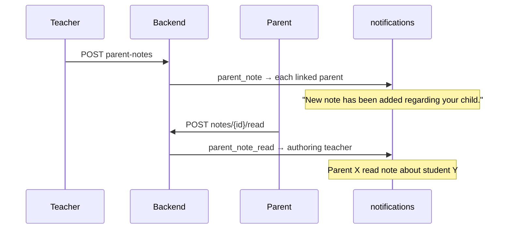

# Phase 5A — Parent Notes System

## Summary

Teachers can publish **structured parent-facing notes** (title, description, category) linked to a student. Linked parents see notes on their dashboard, can filter/sort, and mark notes as read. Teachers see read status and receive notifications.

**Separate from Phase 4 private notes** (`teacher_student_notes`) — those remain teacher-only CRM notes.

---

## Database changes

### `student_parent_notes`

| Column | Type | Notes |
|--------|------|-------|
| `id` | PK | |
| `teacher_profile_id` | FK | Author |
| `student_id` | FK | Target student |
| `title` | varchar(200) | |
| `description` | text | |
| `category` | varchar(32) | academic, attendance, homework, behavior, achievement, warning |
| `created_at`, `updated_at` | timestamptz | |

### `student_parent_note_reads`

| Column | Type | Notes |
|--------|------|-------|
| `id` | PK | |
| `note_id` | FK | CASCADE |
| `parent_id` | FK | Who acknowledged |
| `read_at` | timestamptz | |
| Unique | `(note_id, parent_id)` | |

**Migration:** `0013_student_parent_notes.py`

```bash
cd backend && alembic upgrade head
```

---

## APIs created

### Teacher (`/api/teacher/students`)

| Method | Path | Description |
|--------|------|-------------|
| GET | `/parent-notes/categories` | Category list (Arabic labels) |
| GET | `/{student_id}/parent-notes` | All parent notes for student + read status |
| POST | `/{student_id}/parent-notes` | Create note → notify parents |
| PATCH | `/{student_id}/parent-notes/{note_id}` | Edit (author only) |
| DELETE | `/{student_id}/parent-notes/{note_id}` | Delete (author only) |

### Parent (`/api/parent`)

| Method | Path | Description |
|--------|------|-------------|
| GET | `/notes` | List notes (`student_id`, `category`, `sort`) |
| GET | `/notes/unread-count` | Unread count for linked child |
| GET | `/notes/categories` | Category options |
| POST | `/notes/{note_id}/read` | Mark read → notify teacher |

---

## Authorization

| Actor | Rule |
|-------|------|
| **Teacher create** | Student must have paid access on teacher's course |
| **Teacher edit/delete** | Only `teacher_profile_id` of note author |
| **Teacher view** | Any teacher with scope on that student sees all parent notes |
| **Parent view/read** | Must be linked via `parent_student_links` |
| **Admin** | Future: extend with `require_admin` read-only list (not in 5A UI) |

---

## Notification flow



**Types added:** `NotificationType.parent_note`, `NotificationType.parent_note_read`

---

## Teacher workflow

1. Open **الطلاب** → student profile
2. Section **ملاحظات أولياء الأمور** → **إنشاء ملاحظة**
3. Enter title, category, description → save
4. See read status: `غير مقروءة` / `مقروءة (1/2)` / `مقروءة بالكامل`
5. Edit/delete only own notes

Private section **ملاحظات خاصة** remains below (not sent to parents).

---

## Parent workflow

1. Open **لوحة المراقبة** with linked student
2. **ملاحظات المعلّم** widget shows unread badge
3. Filter by category, sort newest/oldest
4. Tap **تمت القراءة** on unread notes
5. Cannot edit or delete

---

## Files modified / created

### Backend

- `backend/app/models/student_parent_note.py`
- `backend/alembic/versions/0013_student_parent_notes.py`
- `backend/app/schemas/parent_notes.py`
- `backend/app/services/parent_note_service.py`
- `backend/app/api/teacher_students.py` (parent-notes routes)
- `backend/app/api/parent.py` (notes routes)
- `backend/app/models/notification.py` (new types)
- `backend/app/models/__init__.py`

### Frontend

- `src/api/parentNotes.js`
- `src/constants/parentNoteCategories.js`
- `src/components/teacher/TeacherParentNotesSection.vue`
- `src/components/parent/ParentNotesSection.vue`
- `src/views/teacher/TeacherStudentProfileView.vue`
- `src/views/parent/ParentDashboardView.vue`

---

## Categories (Arabic UI)

| Value | Label |
|-------|-------|
| academic | أكاديمي |
| attendance | حضور |
| homework | واجبات |
| behavior | سلوك |
| achievement | إنجاز |
| warning | تنبيه |

---

## Verification

| Check | Result |
|-------|--------|
| Migration `0013` | Applied |
| `npm run build` | Pass |
| Teacher CRUD scoped to author | Yes |
| Parent read-only + mark read | Yes |
| Notifications on create/read | Yes |

---

## Screenshots

UI mockups: teacher student profile **Parent Notes** section and parent dashboard **ملاحظات المعلّم** widget with unread chip and category filters.
