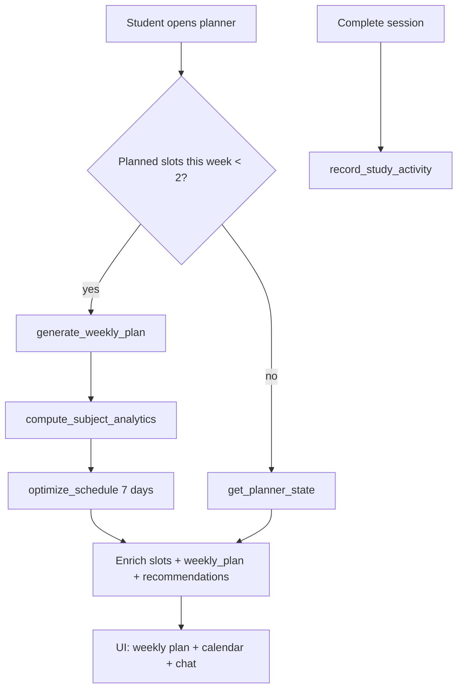

# Phase Next — AI Smart Planner Upgrade

## Summary

The Smart Planner (`المخطط الذكي`) is now a data-driven learning engine: weekly plans, per-subject weakness analytics, priority tiers, study streaks, smart recommendations, parent/teacher read-only views, and student dashboard widgets. The existing calendar and chat planner remain functional.

---

## Database changes

| Migration | Table | Purpose |
|-----------|-------|---------|
| `0021_planner_intelligence.py` | `student_study_streaks` | Tracks `current_streak_days`, `longest_streak_days`, `task_streak_days`, `last_study_date`, `last_task_date` per student |

**Run migration:**

```bash
cd backend
alembic upgrade head
```

Existing planner tables (`planner_profiles`, `planner_schedule_slots`, `planner_life_events`, `planner_chat_messages`) are unchanged.

---

## New backend services

| Service | Role |
|---------|------|
| `student_performance_analytics_service.py` | Per-subject: average score, completion %, missed lessons, failed quizzes → **قوي / متوسط / ضعيف** |
| `planner_intelligence_service.py` | Weekly plan by Arabic weekday, enriched slots (priority tier + task labels), recommendations, dashboard snapshot, visibility snapshot |
| `planner_streak_service.py` | Updates streak on planner session complete |

**Priority engine** (in `schedule_optimizer` + enrichment):

1. Upcoming exam → 🔥 أولوية عالية  
2. Weak subject → 🔥 / ⚠️  
3. Incomplete lessons → ⚠️  
4. Normal review → ✅ أولوية منخفضة  

---

## APIs added / extended

| Method | Path | Audience | Description |
|--------|------|----------|-------------|
| `GET` | `/student/planner` | Student | Full state + `weekly_plan`, `subject_analytics`, `recommendations`, `streak`, `dashboard_snapshot`, `plan_stats` |
| `GET` | `/student/planner/summary` | Student | Same shape (dashboard use) |
| `POST` | `/student/planner/generate` | Student | Force weekly plan generation |
| `POST` | `/student/planner/optimize` | Student | Regenerate plan (existing, now uses analytics) |
| `POST` | `/student/planner/sessions/complete` | Student | Complete slot + record streak |
| `GET` | `/teacher/students/{id}/planner` | Teacher | Read-only `PlannerVisibilityOut` |
| `GET` | `/parent/dashboard` | Parent | `planner` field extended with weekly plan, analytics, streak, missed/completed tasks |

---

## Frontend components added

| Component | Use |
|-----------|-----|
| `PlannerWeeklyPlan.vue` | Day-grouped weekly tasks with priority icons |
| `PlannerSubjectStrength.vue` | Subject strength table |
| `PlannerRecommendations.vue` | Data-driven recommendation list |
| `PlannerDashboardSnapshot.vue` | Dashboard: خطة اليوم، الأولوية، السلسلة، المهمة القادمة |
| `PlannerIntelligencePanel.vue` | Shared read-only panel (parent/teacher) |

**Updated:** `StudentPlannerView`, `StudentDashboardView`, `ParentPlannerPreview`, `TeacherStudentProfileView`, `usePlanner.js`, `PlannerAnalyticsRow`, `PlannerStudySections`, `src/api/planner.js`

---

## Planner logic (high level)



---

## Analytics logic

For each enrolled course (paid access, student grade):

- **Completion %** = completed lessons / total lessons  
- **Average score** = lesson quiz scores + manual `CourseQuizAttempt` scores by subject  
- **Failed quizzes** = attempts &lt; 50%  
- **Strength**: weak if score &lt; 60% or completion &lt; 40%; strong if score ≥ 80% and completion ≥ 70%; else medium  

Weak subjects sync to `PlannerProfile.weak_subjects_json` for the scheduler.

---

## Screenshots to capture locally

1. **Student — `/student/planner`**: weekly plan (الأحد…), subject analytics, recommendations with 🔥/⚠️/✅, streak KPI, calendar unchanged  
2. **Student — `/student/dashboard`**: four planner snapshot cards + link to planner  
3. **Parent — dashboard**: expanded planner card (weekly snippet, streak, missed count)  
4. **Teacher — student profile**: read-only planner section at bottom of learning column  

---

## Verification checklist

- [ ] `alembic upgrade head` succeeds  
- [ ] Plan auto-generates when few planned slots exist  
- [ ] Weak subjects show **ضعيف** with correct course data  
- [ ] Parent dashboard shows weekly plan + streak  
- [ ] Teacher student profile loads `/teacher/students/{id}/planner`  
- [ ] Calendar + chat still work on planner page  
- [ ] `npm run build` passes  

---

## Build

```bash
npm run build
```
