# EduSpark — System Architecture

**Stack:** Vue 3 + Vuetify 3 (SPA) · FastAPI (async) · PostgreSQL · optional Ollama/Gemini · local/S3 media  
**API base:** `/api` (see `settings.API_PREFIX`)  
**Data model reference:** [ERD.md](./ERD.md) · [ERD.dbml](./ERD.dbml)  
**API reference:** [API_ARCHITECTURE.md](./API_ARCHITECTURE.md)

---

## High-level overview

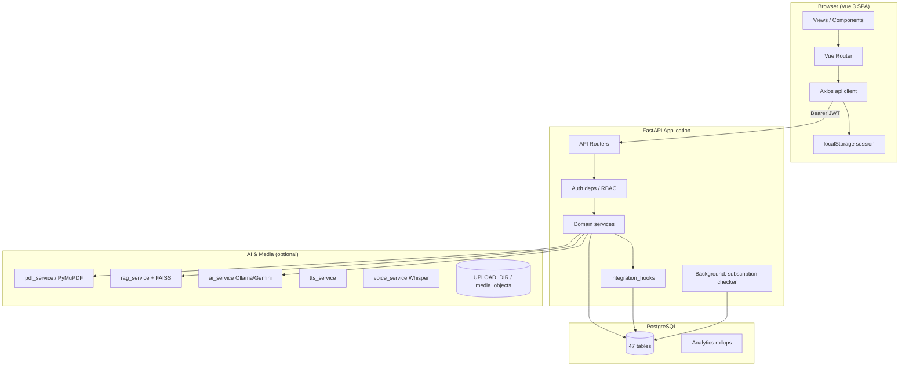

---

## 1. Frontend architecture

### 1.1 Technology

| Layer | Choice |
|-------|--------|
| Framework | Vue 3 (Composition API, `<script setup>`) |
| UI | Vuetify 3 + Material Design Icons |
| Routing | Vue Router 4 (history mode) |
| HTTP | Axios (`src/api/client.js`) |
| Build | Vite 8 |
| i18n / RTL | Arabic-first UI (RTL layouts) |

### 1.2 Project structure

```
src/
├── api/              # Thin HTTP clients per domain (maps to backend routers)
├── components/       # Reusable UI (layout, attendance, parent, settings, …)
├── composables/      # useAuth, useParentMonitor, useAuthSessions, …
├── config/           # navigation.js (sidebar items per role)
├── constants/        # ROUTES, app constants
├── layouts/          # StudentLayout, TeacherLayout, ParentLayout, OnboardingLayout
├── router/           # Guards: auth, onboarding, payment, teacher setup
├── utils/            # session.js, studentFlow.js, format.js
└── views/            # Page-level screens by role
```

### 1.3 Runtime modes

| Mode | Trigger | Behavior |
|------|---------|----------|
| **API mode** | `VITE_USE_MOCK !== 'true'` | All data from FastAPI; JWT on each request |
| **Mock mode** | `VITE_USE_MOCK=true` | Limited local session only (legacy/dev) |

Dev proxy: Vite serves `/api` → backend (`VITE_API_URL` or proxy config).

### 1.4 Layouts and role surfaces

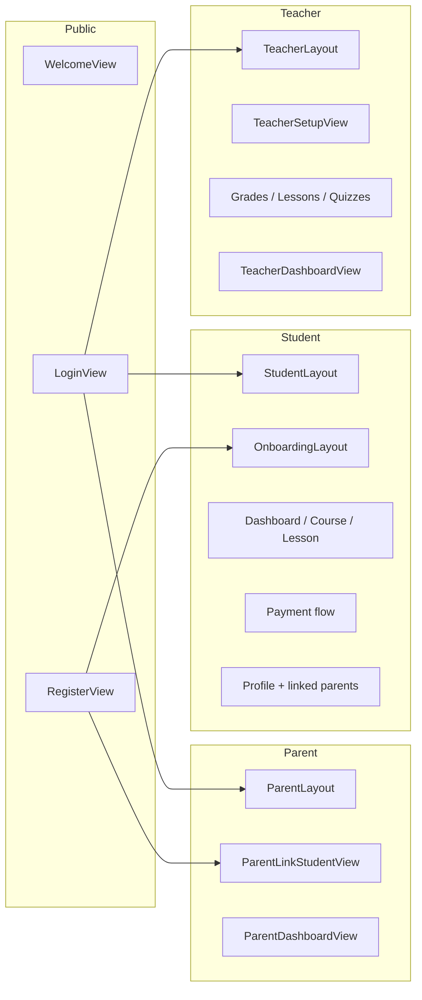

### 1.5 Router guards (`src/router/index.js`)

Guards enforce business rules **before** navigation:

| Guard | Rule |
|-------|------|
| `requiresAuth` | Redirect to `/login` if no session |
| `meta.role` | Student / teacher / parent route isolation |
| `onboardingFlow` | Step order: grade → subjects → teachers |
| `paymentFlow` | Checkout when `needs_payment` (legacy bulk path) |
| `teacherSetup` | Redirect until `teacher_setup_complete` |
| `parentViewer` | Parent layout requires `role=parent` |
| `accountSettings` | Settings pages skip onboarding enforcement |
| `fetchMe` | Refresh flags via `GET /auth/me` on protected routes |

Post-auth routing is centralized in `utils/studentFlow.js` (`resolvePostAuthRoute`, `onboardingRouteForSession`).

### 1.6 State and session

| Concern | Implementation |
|---------|----------------|
| Auth session | `localStorage` key `eduspark_session` (access token, refresh token, `sessionId`, user flags) |
| API auth header | Axios interceptor attaches `Authorization: Bearer` |
| 401 handling | Clear session → redirect `/login` |
| Parent student context | `useParentStudents` + query `student_id` on parent APIs |
| Notifications | `NotificationBell` → `/notifications` |

### 1.7 Frontend ↔ backend mapping

Each `src/api/*.js` module mirrors a backend router group (see [API_ARCHITECTURE.md](./API_ARCHITECTURE.md)).

---

## 2. Backend architecture

### 2.1 Technology

| Layer | Choice |
|-------|--------|
| Framework | FastAPI |
| ORM | SQLAlchemy 2.x (async via `asyncpg`) |
| Migrations | Alembic (`0001` … `0007_subscription_lifecycle`) |
| Auth | JWT access tokens + refresh tokens in `auth_sessions` |
| Validation | Pydantic v2 schemas (`app/schemas/`) |
| Static files | `/uploads` mounted from `UPLOAD_DIR` |

### 2.2 Layered design

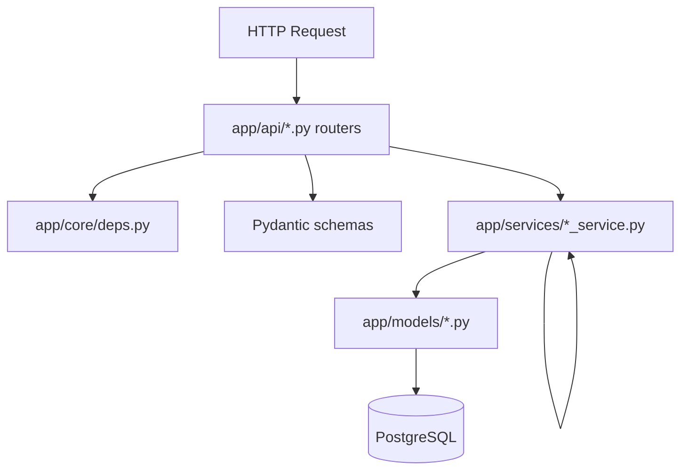

| Layer | Responsibility |
|-------|----------------|
| **Routers** | HTTP mapping, status codes, `Depends()` wiring, `db.commit()` at boundaries |
| **deps** | `AuthContext`, `require_role`, `require_student_actor`, `require_parent`, `require_admin` |
| **Schemas** | Request/response DTOs (API contract) |
| **Services** | Business logic, queries, orchestration |
| **Models** | SQLAlchemy table mappings |
| **integration_hooks** | Side effects after commits: notifications, attendance, analytics refresh |

### 2.3 API router registration

Central registry: `app/api/router.py` — mounts 20+ sub-routers under `/api`.

### 2.4 Key services (by domain)

| Domain | Services |
|--------|----------|
| Auth | `auth_session_service`, `user_status_service` |
| Catalog | `catalog_service`, `teacher_setup_service`, `teacher_courses_service` |
| Lessons | `lesson_processor`, `lesson_assets_service`, `lesson_publish_service`, `lesson_processing_tasks` |
| Student learning | `student_courses_service`, `subscription_service`, `subscription_access_service`, `subscription_expiration_service` |
| Quizzes | `quiz_service` (AI lesson), `course_quiz_service` (manual) |
| Parent | `parent_link_service`, `parent_monitoring_service`, `parent_insight_service`, `parent_subscription_service`, `student_parent_transparency_service` |
| Payments | `payment_service` |
| AI | `ai_service`, `rag_service`, `embedding_service`, `pdf_service`, `voice_service`, `tts_service`, `ai_job_service` |
| Ops | `notification_service`, `attendance_service`, `attendance_activity_service`, `analytics_rollup_service`, `grade_report_service`, `audit_service` |
| Planner | `planner_chat_service`, `schedule_optimizer`, `planner_memory_service` |

### 2.5 Application lifecycle (`app/main.py`)

| Startup | Action |
|---------|--------|
| `init_db()` | Connectivity check; optional pgvector extension |
| Background task | `_subscription_expiration_loop()` — periodic expiry notifications |
| Static mount | `/uploads` for lesson PDFs, voice, avatars |

### 2.6 Security model

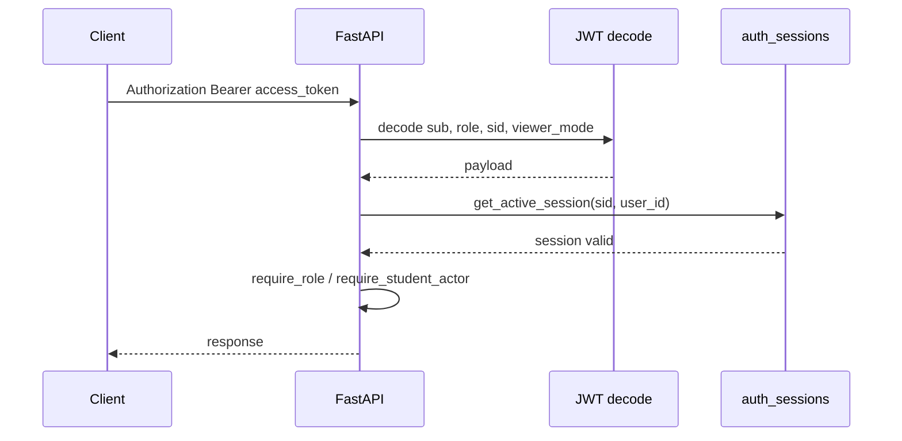

- Access token embeds `sub` (user id), `role`, optional `sid` (session id).
- Each request with `sid` validates session not revoked/expired (`auth_session_service.get_active_session`).
- Role checks are **additive** to `users.role`; extended roles via `user_roles` + `roles` (e.g. admin audit API).

---

## 3. Database architecture

### 3.1 Overview

- **47 tables** in PostgreSQL (see [ERD.md](./ERD.md)).
- **Single database**; no per-tenant schemas.
- **Alembic** is the source of truth for schema evolution (head: `0007_subscription_lifecycle`).

### 3.2 Domain clusters

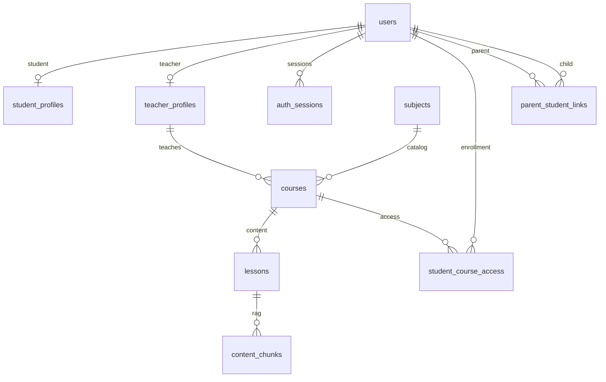

### 3.3 Identity model

| Concept | Storage |
|---------|---------|
| All account types | `users` (`role` enum: student, teacher, parent) |
| Student extension | `student_profiles` (1:1) |
| Teacher extension | `teacher_profiles` (1:1) |
| Parent | No separate profile — `users` + `parent_student_links` |
| Admin / extra roles | `roles` + `user_roles` |

### 3.4 Enrollment and subscriptions

| Table | Purpose |
|-------|---------|
| `student_course_access` | Per-student per-course unlock; `payment_status`, `activated_at`, `expires_at` |
| `payments` / `payment_items` | Checkout records (bulk or audit trail) |
| Per-course subscribe | `subscription_service` → `activate_paid_access()` |

Access check: `subscription_access_service.is_access_active()` — paid **and** `expires_at > now`.

### 3.5 Analytics pattern

Pre-aggregated rollups (refreshed by `analytics_rollup_service` via hooks):

| Table | PK |
|-------|-----|
| `course_analytics` | `course_id` |
| `teacher_analytics` | `teacher_profile_id` |
| `student_analytics` | `student_id` |
| `student_grade_reports` | `id` (unique student+course) — parent dashboard |

### 3.6 Media

| Table | Role |
|-------|------|
| `media_objects` | Storage metadata (local/S3/R2/MinIO) |
| `lesson_assets` | Ordered assets per lesson, optional FK to `media_objects` |
| Legacy columns on `lessons` | `pdf_path`, `video_url`, `voice_path` (synced by `lesson_assets_service`) |

---

## 4. AI pipeline architecture

EduSpark has **two quiz systems** and **one lesson intelligence pipeline**.

### 4.1 Lesson processing pipeline

Triggered by teacher upload/process endpoints → `lesson_processor.process_lesson()` (and/or `ai_jobs` queue).

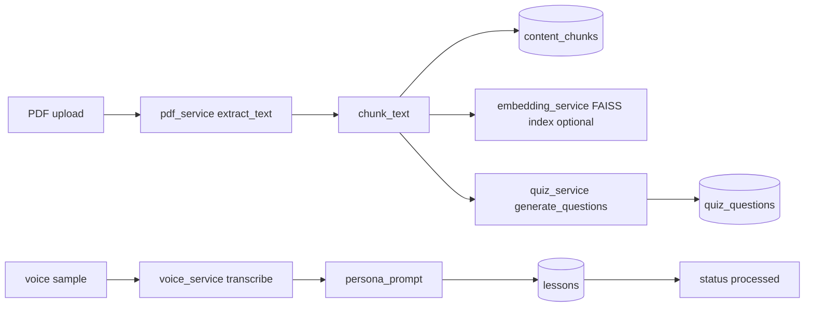

| Step | Service | Output |
|------|---------|--------|
| PDF text extraction | `pdf_service` | `lessons.preview`, `page_count` |
| Chunking | `pdf_service.chunk_text` | `content_chunks` rows |
| Vector index (optional) | `embedding_service` | FAISS under `VECTOR_INDEX_DIR` |
| Voice / persona | `voice_service`, `teacher_voice_service` | `lessons.persona_prompt` |
| Quiz generation | `quiz_service` | `quiz_questions` (AI lesson quiz) |
| Job tracking | `ai_job_service` | `ai_jobs` row (pending → running → completed) |

Config flags: `ENABLE_PGVECTOR`, `ENABLE_EMBEDDINGS`, `LLM_PROVIDER` (default `gemini`; optional `ollama` dev fallback), `GEMINI_API_KEY`, `ENABLE_WHISPER`, `ENABLE_TTS`.

### 4.2 Student tutor chat (RAG)

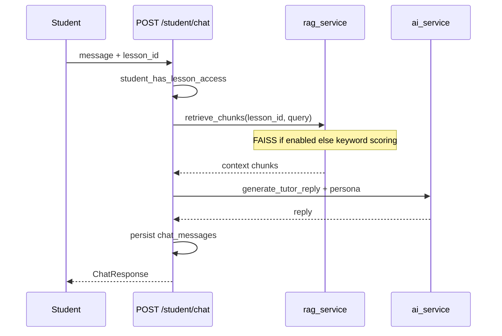

### 4.3 AI jobs API

- Enqueue: lesson process / publish flows create `ai_jobs` rows.
- Poll: `GET /ai/jobs/{job_id}` for status/result.
- Workers run **in-process** (same app) via `lesson_processing_tasks` — not a separate worker service in repo.

### 4.4 Teacher voice profile

| Step | Endpoint / service |
|------|-------------------|
| Upload sample | `POST /teacher/voice-sample` → `teacher_voice_samples` |
| Process | `teacher_voice_service` → transcript + persona |
| TTS preview | `tts_service` (optional `ENABLE_TTS`) |

Voice informs lesson chat persona and optional answer audio.

---

## 5. Authentication flow

### 5.1 Registration

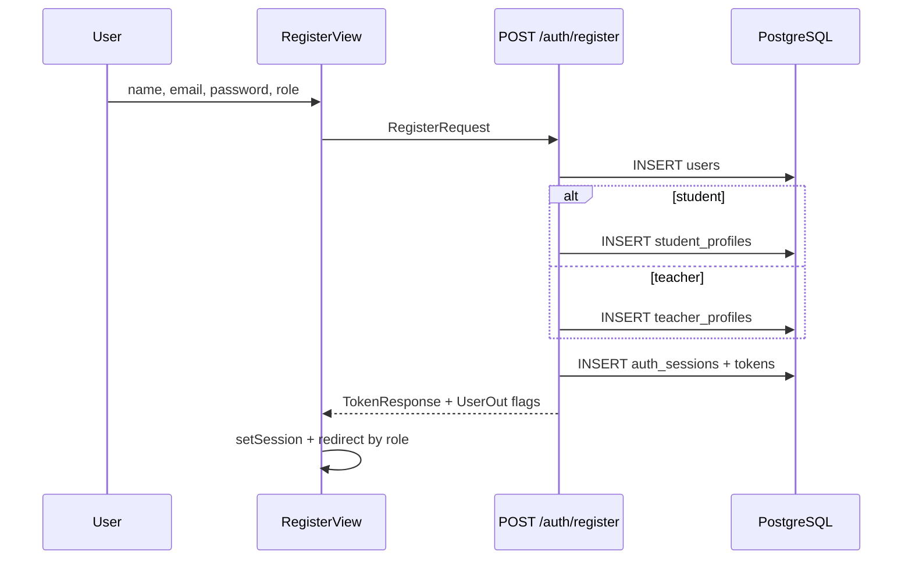

| Role | Post-register redirect (frontend) |
|------|-----------------------------------|
| student | Onboarding grade |
| teacher | Teacher setup or dashboard |
| parent | `/parent/link` |

### 5.2 Login and session

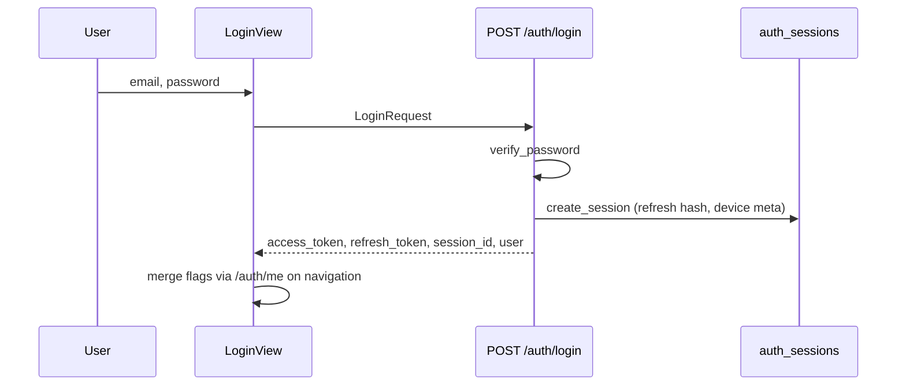

### 5.3 Session management (multi-device)

| Action | API |
|--------|-----|
| List devices | `GET /auth/sessions` |
| Revoke one | `DELETE /auth/sessions/{id}` |
| Revoke all | `DELETE /auth/sessions` |
| Logout current | `POST /auth/logout` |

Frontend: `UserSettingsView` → `SecurityDevicesSection` (`useAuthSessions`).

### 5.4 Authorization matrix (simplified)

| Dependency | Allows |
|------------|--------|
| `get_auth_context` | Any valid JWT + active session |
| `require_role(teacher)` | `users.role == teacher` |
| `require_role(student)` | `users.role == student` |
| `require_parent` | `users.role == parent` |
| `require_student_actor` | Student writes (blocks parent viewer mode if reintroduced) |
| `require_admin` | `user_roles.slug == admin` |

---

## 6. Parent monitoring flow

Parents are **read-only monitors** of linked students (no student credential sharing at registration).

### 6.1 Linking flow

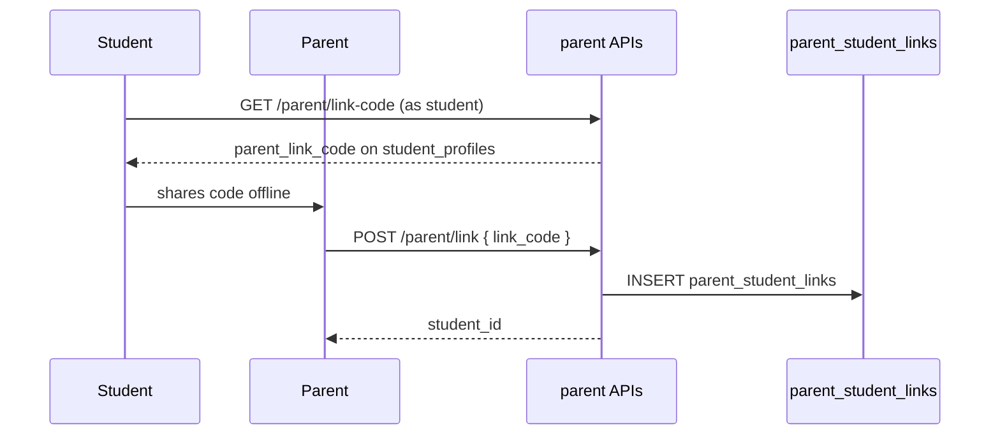

### 6.2 Dashboard aggregation

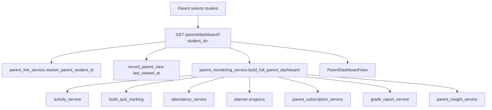

| UI section | Data source |
|------------|-------------|
| Child summary | `users` + stats |
| Subscriptions | `student_course_access` via `list_student_subscription_status` |
| Quiz tracking | `quiz_attempts` + course manual quizzes |
| Attendance | `student_attendance_records` |
| Planner | `planner_schedule_slots` |
| Activity feed | `student_activity_events` |
| AI insights | `parent_insight_service` (rule-based + quiz scores) |

### 6.3 Student transparency (inverse)

Students see who is linked: `GET /student/linked-parents` → `StudentLinkedParentsSection` on profile.

---

## 7. Subscription lifecycle flow

### 7.1 Activation

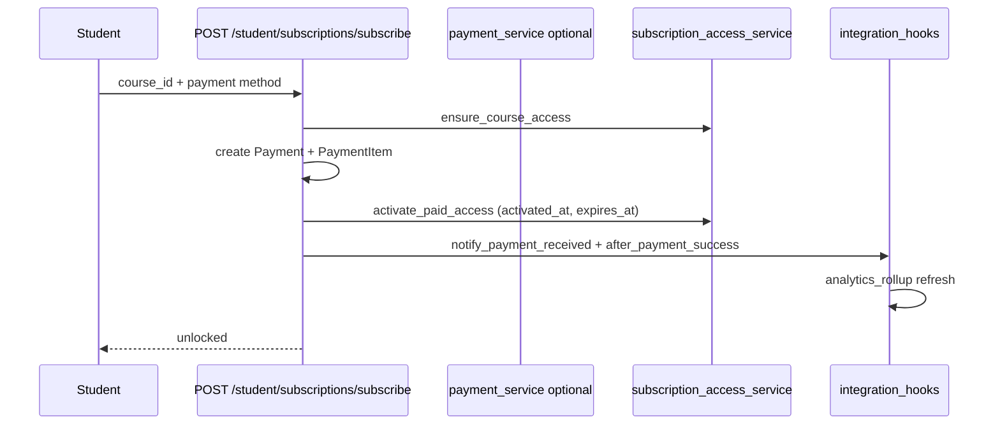

Renewal while active: `activate_paid_access` **extends** `expires_at` from current expiry.

### 7.2 Access enforcement

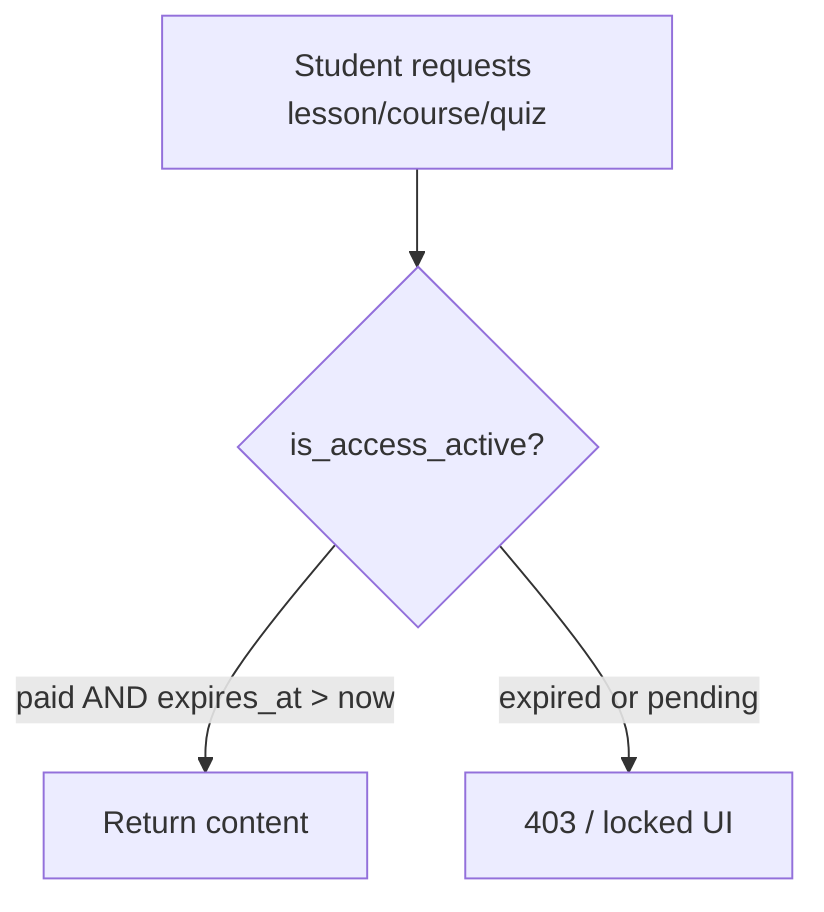

Used in: `student_courses_service`, `student_has_lesson_access`, `course_quiz_service._student_has_paid_access`, `notification_service.notify_course_students` (active only).

### 7.3 Expiration notifications

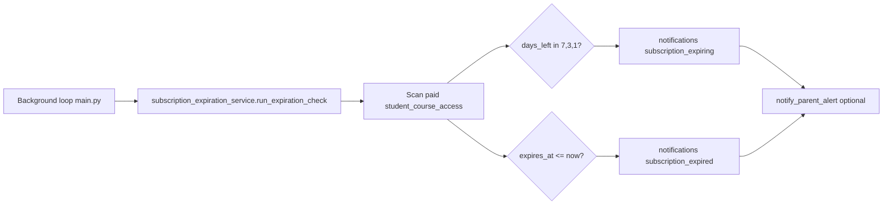

Dedup: notification `payload` contains `access_id` + `marker` (e.g. `expiring_d7`, `expired`).

### 7.4 UI surfaces

| Actor | Surface |
|-------|---------|
| Student | Course cards show expiry chip, lock reason, renew CTA |
| Teacher | Dashboard subscriber counts: active / expiring / expired |
| Parent | `ParentSubscriptionsSection` on dashboard |

---

## 8. Cross-cutting concerns

| Concern | Implementation |
|---------|----------------|
| Notifications | `notifications` table + bell UI; types in `NotificationType` enum |
| Attendance | Auto-write on lesson complete / quiz submit (`attendance_activity_service`) |
| Audit | `audit_logs` + `GET /admin/audit-logs` (admin role) |
| CORS | `settings.cors_list` |
| File uploads | Multipart → `UPLOAD_DIR`; size limits in `config` |

---

## 9. Deployment notes (reference)

| Component | Typical deployment |
|-----------|-------------------|
| Frontend | Static build behind CDN or Vite preview |
| Backend | Uvicorn / Docker (`backend/Dockerfile`) |
| Database | PostgreSQL 14+ |
| Migrations | `alembic upgrade head` before serving traffic |
| AI | Optional GPU host for Whisper; Ollama sidecar for LLM |

---

## 10. Related documents

| Document | Contents |
|----------|----------|
| [ERD.md](./ERD.md) | Full entity list, FKs, Mermaid ERD diagrams |
| [ERD.dbml](./ERD.dbml) | DBML for dbdiagram.io |
| [API_ARCHITECTURE.md](./API_ARCHITECTURE.md) | Complete route catalog |
