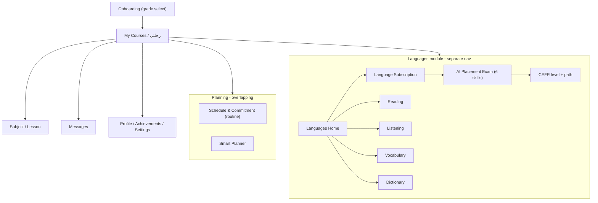

# STUDENT_UI_AUDIT — EduSpark (Student Experience)

## 0. Method & scope

- 32 screenshots mapped to real routes/views in `src/router/index.js` and `src/views/student/**`.
- Shell = `src/layouts/StudentLayout.vue` + `src/components/layout/AppHeader.vue` + `src/components/layout/StudentSidebar.vue`.
- A real design-token layer exists in `src/assets/styles/tokens.css` and shared classes in `src/assets/styles/design-system.css`. The problem is **adoption**, not absence: **42 separate CSS files** and **313 components** indicate heavy per-feature styling instead of a shared system.

---

## 1. All screens found

Grouped by product area, each mapped to its view:

**Core / dashboard**
- My Courses / Journey (`رحلتي`) — `src/views/student/StudentDashboardView.vue` — hero "مساء الخير", materials cards, "تابع من حيث توقفت", achievements teaser.
- Messages (`الرسائل`) — empty-conversations state.
- Subscriptions (`الاشتراكات`) — `src/views/student/StudentSubscriptionsView.vue` — subject cards (locked/active), purple CTAs.

**Planning (two overlapping planners)**
- Schedule & Commitment (`المخطط والالتزام`) — `src/views/student/StudentRoutineView.vue` — seen in **two distinct UIs**: a chat/preview builder and a long structured form (grade, school hours, sleep, days, extra activities).
- Smart Planner (`المخطط الذكي`) — `src/views/student/StudentPlannerView.vue`.

**Account**
- Profile / "من أنا" — `src/views/student/StudentProfileView.vue` — very long RTL form (goals, learning style, interests, guardian link code).
- Achievements (`إنجازاتي`) — `src/views/student/StudentAchievementsView.vue` — level/XP, streak, badges, XP rules.
- Settings — shared settings view.

**Languages module (its own world)**
- Languages Home / "Welcome back" — `src/views/student/languages/StudentLanguagesHubView.vue`.
- Language Subscription paywall ("Learn English") — `src/views/student/languages/StudentLanguageSubscribeView.vue`.
- AI Placement Exam (intro + 6 skill steps: Interview, Writing, Grammar/Vocab, Reading, Listening, Speaking) — `src/views/student/languages/StudentLanguageExamView.vue`.
- Reading (landing + passage) — `src/views/student/languages/StudentLanguageReadingView.vue`.
- Listening (landing + question) — `src/views/student/languages/StudentLanguageListeningView.vue`.
- Vocabulary — `src/views/student/languages/StudentLanguageVocabularyView.vue`.
- Dictionary — `src/views/student/languages/StudentLanguageDictionaryView.vue`.
- (Router also has Writing, Speaking, Curriculum, Lessons, Progress, Insights, Certificates, History views not all screenshotted.)

**Onboarding**
- Grade selection ("في أي صف تدرس؟") — full-screen, no sidebar.

---

## 2. Student flows

Key flow facts:
- Two nav paradigms: the global **sidebar** (Learning / Planning / Account groups from `src/config/navigation.js`) vs. the **language top-tab carousel** (Lessons · Curriculum · Speaking · Writing · Dictionary · Vocabulary · Listen · Reading · Home). Entering Languages effectively swaps the whole navigation model.
- The AI Exam is a linear stepper flow with its own header treatment.

---

## 3. Current design patterns (the real system)

- **Tokens exist**: brand indigo `--em-primary #6366f1`, cyan accents, morning/night themes, radius scale (8–24px), spacing scale, Tajawal/Cairo fonts (`tokens.css`).
- **Shared classes exist**: `.content-card`, `.em-btn--primary/secondary/ghost`, `.edu-dialog-card`, empty-state, skeletons (`design-system.css`).
- **Recurring visual motifs**:
  - Gradient "aurora" page background (`AuroraBackground.vue`).
  - Language pages: hero banner with "LEARN LANGUAGES" eyebrow + large English title + subtitle.
  - Rounded white cards with soft shadow.
  - Sidebar with 3 grouped sections + pinned "معلمك الذكي" promo card.
  - Chips/segmented toggles (Long/Medium/Short, day pickers, interests).
  - Stat/KPI tiles (Achievements, Languages levels A2 cards).

---

## 4. Inconsistencies (highest-signal findings)

1. **Two primary-button colors.** Language module uses a **teal/cyan** gradient (Start reading, Submit, Start the exam); the rest of the app uses **indigo/purple** (`اشترك الآن`, `ابدأ الدرس`, `متابعة التعلم`). There is no single "primary action" identity.
2. **Brand name split.** Sidebar logo reads **"EduMind"**, product/titles say **"EduSpark"** (and files reference both "EduSpark / EduMind"). Confusing identity.
3. **Header title language mismatch.** `AppHeader` page titles render in **English** ("Messages", "Schedule & Commitment", "Subscriptions", "My Courses", "Vocabulary", "My Achievements") on top of an otherwise **Arabic RTL** UI.
4. **Two navigation systems** (global sidebar vs. language LTR tab-carousel) — different interaction model, direction, and typography inside the same app.
5. **Duplicate planners.** "المخطط والالتزام" (routine) and "المخطط الذكي" (planner) are separate screens with overlapping "plan my study" intent.
6. **The routine screen itself has two different UIs** (chat-preview builder vs. long structured form) — feels like two unmerged designs of one feature.
7. **Mixed-direction content.** Language screens embed LTR English blocks (tabs, passages, MCQs) inside the RTL shell; question numbering/labels flip inconsistently ("Reading — question 1" LTR while page is RTL).
8. **Card system drift.** Dashboard subject cards, subscription cards, language hero cards, and achievement tiles use visibly different radii, paddings, and shadow weights despite `.content-card` existing.
9. **Header inconsistency across exam screens.** Some exam screens hide/alter the theme toggle & notification bell vs. the standard `AppHeader`.
10. **42 CSS files** with feature-scoped names (`language-home.css`, `student-home.css`, `student-experience.css`, `ui-6.4-course-messages.css`, `ui-course-7.1.css`, `ui-msg-7-messages.css`…) — versioned/one-off stylesheets are a maintenance and consistency hazard.

---

## 5. UX problems

- **Continuity break** entering Languages: sidebar context disappears behind a tab carousel; hard to know "where am I in the app."
- **Onboarding vs. planner overlap**: grade is asked in onboarding AND again inside Schedule & Commitment.
- **Placement paywall friction**: "Learn English" paywall gates the whole language experience with little preview of value.
- **Long, dense forms** (Profile, Routine form, Smart Planner, Settings render as very tall pages) with weak sectioning/anchoring → high scroll cost, easy to lose place in RTL.
- **Empty states** (Messages, Achievements streak = 0) are functional but flat; no guided next action for a new student.
- **Language of instruction ambiguity**: Arabic learners get English chrome in the language module (tab labels, buttons) — cognitively taxing for lower levels.
- **Exam stepper chips** can overflow/crowd on narrow widths; progress state (done vs. current vs. locked) relies mostly on color.

---

## 6. Components that should be reused (consolidate onto these)

- **PageHero / banner** — one component for the "eyebrow + title + subtitle" hero used across all language pages and dashboards (`src/components/common/PageHeader.vue` as base).
- **Card** — standardize on `.content-card` (from `design-system.css`) for subject cards, subscription cards, language cards, KPI tiles.
- **Primary button** — single `.em-btn--primary`; pick ONE gradient (see §8).
- **Empty state** — `src/components/ui/AppEmptyState.vue` everywhere (Messages, zero-XP, no passages).
- **Segmented toggle / chip group** — one component for length toggles, day pickers, interests, CEFR level.
- **Stat tile** — one KPI card for Achievements + Languages levels + dashboard counters.
- **Section wrapper** — `src/components/ui/AppSection.vue` to give long forms consistent headers/spacing.
- **Assistant/promo card** — the "معلمك الذكي" panel unified as the AI presence element.

---

## 7. Screens that need redesign (priority order)

1. **Languages module navigation** — reconcile the tab-carousel with the global sidebar; make Languages feel *inside* EduSpark, not a separate app.
2. **Planning consolidation** — merge/relate "Schedule & Commitment" and "Smart Planner"; collapse the routine screen's two UIs into one.
3. **Schedule & Commitment form** — restructure the long form into stepped/anchored sections with consistent controls.
4. **Profile & Settings** — same long-form treatment; sectioned, RTL-correct, consistent inputs.
5. **AI Placement Exam** — unify header, stepper progress states (icon+color+text), and per-skill layouts (Speaking/Listening/Reading/Writing/Grammar currently vary).
6. **Dashboard (My Courses)** — align card system and hero with the rest; strengthen "continue where you left off" hierarchy.
7. **Empty/zero states** across Messages & Achievements.

---

## 8. Recommended unified design direction

Treat EduSpark as **one connected AI learning platform** with a single system, not per-feature stylesheets:

- **One identity**: resolve EduSpark vs. EduMind; one brand mark, one wordmark, one AI-assistant motif ("معلمك الذكي") reused everywhere.
- **One primary color for actions**: choose indigo `--em-primary` as the single primary CTA; demote teal to a *language-module accent only* (or drop the dual-primary entirely). No two "primary" gradients.
- **One nav model**: keep the global sidebar as the constant frame; render Languages' sub-navigation as a *secondary* in-page nav that clearly sits under the sidebar (not a replacement), preserving RTL.
- **RTL-first, bilingual-aware**: header/page titles localized (Arabic in Arabic UI); explicitly design LTR "English content islands" (passages, exam items) as intentional embedded blocks with correct bidi handling — not accidental LTR chrome.
- **Adopt the existing tokens/classes** (`tokens.css`, `design-system.css`) as the source of truth; **retire the 42 ad-hoc CSS files** into a small shared set (tokens, base, components, 2–3 feature overrides). Enforce `.content-card`, `.em-btn`, `AppSection`, `AppEmptyState`, `PageHeader`.
- **Consistent page skeleton**: `PageHero → sectioned content (AppSection) → cards`, with one spacing scale and one radius scale from tokens.
- **Long forms → stepper/anchored sections** with sticky section nav for Profile, Routine, Planner, Settings.
- **Accessibility baseline**: never status-by-color-only (add icon+label to locked/active, exam step state); ensure ≥4.5:1 for muted text on gradients; larger tap targets for radios/chips; visible focus (`--em-focus-ring`) on custom buttons.
- **Responsive**: define wrap/scroll behavior for the language tab carousel and exam stepper; stack exam skill layouts predictably on narrow widths.

---

## Notes / caveats

- The referenced folder `docs/ui-audit/student-screenshots/` did not exist in the repo; screenshots were read from the message attachments.
- Screens like Curriculum, Writing, Speaking-live, Progress, Insights, Certificates exist in code but weren't in the 32 shots — they should be included when moving to redesign so the system stays unified.
